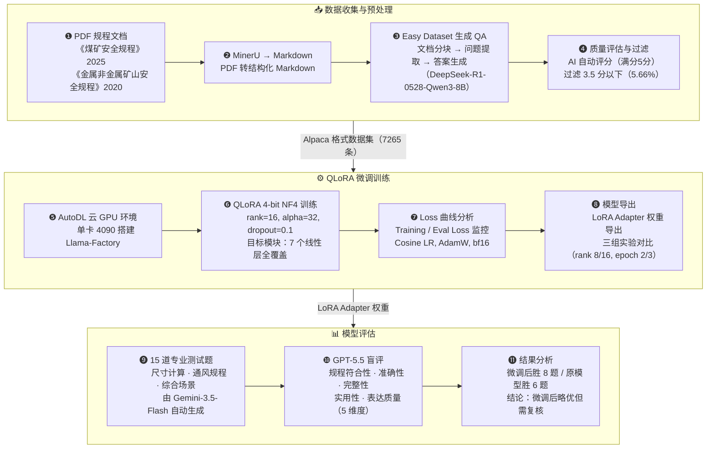

# 矿山安全领域 QLoRA 微调 Qwen2.5-7B-Instruct

> 用 QLoRA 对 [Qwen2.5-7B-Instruct](https://huggingface.co/Qwen/Qwen2.5-7B-Instruct) 做矿山安全领域微调。
> 训练数据来自《煤矿安全规程》（2025）和《金属非金属矿山安全规程》（2020）。
> 框架：[Llama-Factory](https://github.com/hiyouga/LLaMA-Factory) | 实验追踪：[SwanLab](https://github.com/SwanHubX/SwanLab)

> 微调方法基于三篇核心论文（含手写精读笔记）：[Attention Is All You Need](docs/papers/Attention%20Is%20All%20You%20Need%20及手写笔记.pdf)（Transformer 架构）、[LoRA](docs/papers/LoRA%20Low-Rank%20Adaptation%20of%20Large%20Language%20Models%20及手写笔记.pdf)（低秩适配微调）、[QLoRA](docs/papers/QLoRA%20Efficient%20Finetuning%20of%20Quantized%20LLMs%20及手写笔记.pdf)（4-bit 量化微调）。精读笔记见下方，理论分析见 [3. 理论基础](#3-理论基础)。

---

## 论文精读笔记

三篇论文的精读笔记以手写批注为基础整理，包含公式推导、概念理解和关键实验结论。笔记 PDF 原件见 [`docs/papers/`](docs/papers/)，整理后的 Markdown 笔记见 [`docs/notes/`](docs/notes/)。

| 论文 | 笔记 | 核心内容 |
|------|------|---------|
| [Attention Is All You Need](docs/papers/Attention%20Is%20All%20You%20Need%20及手写笔记.pdf) (Vaswani et al., 2017) | [Transformer 笔记](docs/notes/1.%20Transformer.md) | 四类基础架构对比、注意力机制（自注意力/多头/交叉）、编码器与解码器、LayerNorm、位置编码、Dropout、FFN |
| [LoRA](docs/papers/LoRA%20Low-Rank%20Adaptation%20of%20Large%20Language%20Models%20及手写笔记.pdf) (Hu et al., 2021) | [LoRA 笔记](docs/notes/2.%20LoRA.md) | 低秩分解与内在维度、熵/交叉熵/KL 散度推导、Adam/AdamW 优化器、SVD 分析、ΔW 特征放大效应、与其他 PEFT 对比 |
| [QLoRA](docs/papers/QLoRA%20Efficient%20Finetuning%20of%20Quantized%20LLMs%20及手写笔记.pdf) (Dettmers et al., 2023) | [QLoRA 笔记](docs/notes/3.%20QLoRA.md) | 量化与反量化公式、分块量化、NF4 分位数构造、双重量化显存计算、前向传播公式 |

---

## 1. 效果展示

微调前后使用 Gemini-3.5-Flahs 根据 Markdown 数据集生成的 15 道矿山安全领域专业测试题进行对比，由 GPT-5.5 基于规程原文进行盲评：

| 维度 | 原模型 (Answer1) | 微调后 (Answer2) |
|------|-----------------|-----------------|
| 规程数值准确性 | 较差，常编造公式和参数 | 更接近规程硬性指标 |
| 综合场景覆盖 | 更全面，框架更完整 | 偏简略，但更安全 |
| 虚构数据风险 | 高（编造经验公式、单位错误） | 较低 |
| **GPT-5.5 盲评胜负** | **胜 6 题** | **胜 8 题，平 1 题** |

**典型对比示例：**

**问题：** 井下双轨运输大巷的允许风速范围是多少？

| | 原模型回答 | 微调后回答 |
|---|-----------|-----------|
| 风速范围 | 0.15 ~ 6 m/s（笼统套用） | 1.0 ~ 8 m/s（更符合架线电机车巷道规程） |
| GPT-5.5 评价 | 适用范围混乱，规程数值不准确 | 数值更接近规程表 |

> 详细评估问题、回答及结果见 [Evaluation/](./Evaluation/) 目录，包含 15 道测试题和完整 GPT-5.5 盲评报告。

---

## 2. 项目概览

- 7265 条 QA 对，经 DeepSeek-R1-0528-Qwen3-8B 自动评分后过滤掉 5.66% 低质量数据
- 4-bit NF4 量化 + LoRA，单张 GPU 训练 1~1.5 小时
- 训练数据含 `<think>` 推理链
- 跑了 3 组对比实验（rank 8/16，epoch 2/3），找到最优配置
- 用 GPT-5.5 做盲评，15 道专业题、5 个评分维度

---

## 3. 理论基础

> 三篇论文构成了本项目"为什么这样做"的完整理论链。以下结合手写笔记中的关键理解，说明论文如何指导了实际的微调决策。

### 3.1 Transformer 论文

**指导作用**：

- **理解 Target modules 的含义**：本项目将 LoRA 施加于 `q_proj, k_proj, v_proj, o_proj, gate_proj, up_proj, down_proj` 共 7 个模块。其中前 4 个对应 Transformer 多头注意力中的 $W^Q, W^K, W^V, W^O$ 线性投影层，后 3 个对应 Position-wise FFN 中的门控投影和上下投影。不理解 Transformer 架构就无法理解这些参数的含义。
- **Qwen2.5-7B-Instruct 的架构**：基座模型是 28 层 Transformer 解码器（decoder-only），隐藏维度 $d_{\text{model}}=3584$，28 个注意力头，每头维度 $d_k = d_v = 3584/28 = 128$。理解这个架构才能估算 LoRA 适配器的参数量和显存占用。
- **解码器自回归生成**：Qwen2.5 使用带掩码的自注意力，每个 token 只能看到当前位置及之前的内容（因果掩码）。这决定了模型的生成方式——逐 token 预测，也决定了训练数据需要 `<think>` 推理链格式。
- **FFN 的门控机制**：Qwen2.5 的 FFN 使用 SwiGLU 门控结构（`gate_proj` × `up_proj` → 激活 → `down_proj`），而非原始 Transformer 的两层 FFN + ReLU。本项目对这三个投影层都施加了 LoRA，覆盖了 FFN 的全部参数。
- **Cutoff length=2048 与序列长度**：Transformer 的自注意力计算量与序列长度的平方成正比（**复杂度：$O(n^2d)$**）。本项目设 cutoff=2048，与数据集最大分块长度对齐，同时控制显存消耗（每增 1K token 约 +2.5GB 激活值显存）。
- **位置编码**：Qwen2.5 使用 RoPE（旋转位置编码）而非原始 Transformer 的正弦/余弦位置编码，支持更长的上下文窗口。理解位置编码机制有助于理解模型对长文本的处理能力。
- **LayerNorm 与残差连接**：Transformer 的每个子层（注意力、FFN）都有残差连接和 LayerNorm，这使得 28 层深网络能够稳定训练。LoRA 适配器的输出通过残差路径与原始权重的输出相加，不破坏原有的信息流。

### 3.2 LoRA：为什么不改原始权重？

[LoRA: Low-Rank Adaptation of Large Language Models](docs/papers/LoRA%20Low-Rank%20Adaptation%20of%20Large%20Language%20Models%20及手写笔记.pdf) (Hu et al., 2021)

**指导作用**：

- **rank 参数选择（$r=16$）**：LoRA 的核心假设是"内在维度"——预训练模型针对下游任务的有效更新集中在一个低维子空间中。论文实验表明 $r=1$ 在 $\{W_q, W_v\}$ 上已具备竞争力，$r=64$ 并未显著优于 $r=4$。本项目对比 epoch=3 的两组实验 test1（rank=16）和 test3（rank=8），说明矿山安全领域需要比论文默认值更高的秩来捕获专业特征。
- **$\alpha = 2 \times r$（32）**：训练时 $\Delta W$ 乘以 $\frac{\alpha}{r}$，因此 $\alpha$ 和 $r$ 的比值等效于控制 LoRA 分支的学习率。论文指出调整 $\alpha$ 大致等同于调整学习率（**梯度更新公式中学习率和缩放因子 $\frac{\alpha}{r}$ 直接乘在一起**）。本项目设 $\alpha=32$，使 $\frac{\alpha}{r}=2$ 为常数，这是社区广泛采用的经验值。
- **Target modules 覆盖所有线性层（7 个）**：默认只加 `q_proj`/`v_proj`，但 LoRA 论文实验表明"分散优于集中"——同时适应多个权重矩阵比集中增加单矩阵秩更有效。本项目加上 `k_proj`/`o_proj`/`gate_proj`/`up_proj`/`down_proj`，覆盖所有线性层。
- **Dropout=0.1 防过拟合**：LoRA 适配器的 dropout 防止小数据集过拟合，配合 AdamW 的 weight decay 一起起作用。
- **学习率 $2 \times 10^{-4}$**：LoRA 只更新低秩适配器（不改原始权重），比全参数微调需要更大学习率。全参数微调通常小一个数量级（如 $2 \times 10^{-5}$）。
- **AdamW 优化器**：LoRA 论文中使用 AdamW，其 weight decay 解耦修正使权重衰减不受自适应学习率影响，泛化更好。
- **零推理延迟**：部署时可将 $\Delta W = BA$ 直接合并到 $W_0$ 中（$W = W_0 + BA$），不增加任何额外计算，这是 LoRA 相比 Adaptor 和 Prefix Tuning 的关键优势。
- **SVD 分析验证**：论文通过 SVD 发现 $\Delta W$ 并非随机扰动，而是放大了 $W$ 中已存在但未被强调的任务特定方向（$r=4$ 时放大因子高达 21.5 倍），验证了低秩适应的充分性。

### 3.3 QLoRA：为什么能单卡微调 7B 模型？

[QLoRA: Efficient Finetuning of Quantized LLMs](docs/papers/QLoRA%20Efficient%20Finetuning%20of%20Quantized%20LLMs%20及手写笔记.pdf) (Dettmers et al., 2023)

**指导作用**：

- **4-bit NF4 量化实现单卡训练**：本项目使用 RTX 4090（24GB）微调 7.6B 参数的 Qwen2.5。QLoRA 论文提出的 NF4 量化格式将模型权重从 FP16 压缩到 4-bit，使显存从约 14GB（仅模型权重）降至约 3.5GB，腾出空间给 LoRA 适配器和激活值。没有 QLoRA 的量化技术，单卡 4090 无法完成 7B 模型的微调。
- **双重量化进一步压缩显存**：分块量化每 block 需要一个 FP32 的缩放因子 $c_2$，双重量化对 $c_2$ 本身再做 8-bit 量化，从 4.500 降至 4.127 bits/param，节省 0.373 bits/param。本项目配置中启用了双重量化。
- **4-bit 存储 + FP16 计算的前向传播**：基模型权重以 4-bit NF4 驻留显存，仅在前向/反向传播时反量化为 BFloat16 参与计算（公式 5）。本项目设 bf16=True，利用 4090 的 Ampere 架构支持。
- **Target modules 全覆盖**：QLoRA 论文实验表明，对所有线性层施加 LoRA 比只加 attention 投影效果更好，且 rank 可以更低。本项目据此覆盖了全部 7 个线性层。
- **分块大小 blocksize=64**：QLoRA 论文建议每 64 个参数为一个量化块，避免极端值污染整个张量的量化精度。本项目使用默认的 blocksize=64。
- **NF4 的信息论最优性**：NF4 针对正态分布权重设计，取 $\mathcal{N}(0,1)$ 的 $2^4+1=17$ 个分位数构造 16 个量化值，确保每个量化区间内的数据量相等，比普通 INT4 保留更多精度。
- **Epoch=2 提前停止**：三组实验中 Test 1 和 Test 3 都在第 3 个 epoch 出现 eval loss 反弹（$\sim 0.86 \to \sim 0.92$），过拟合信号明显。Test 2 在 epoch=2 停下来，loss 最低（0.8679），训练时间也最短（$\sim$64 min）。这验证了小数据集不宜训练过多轮次。

## 4. 方法流程



**工具链接：**
| 工具 | 用途 | 链接 |
|------|------|------|
| MinerU | PDF 转 Markdown | [在线平台](https://mineru.net/OpenSourceTools/Extractor) |
| Easy Dataset | QA 数据集生成 | [使用教程](https://zhuanlan.zhihu.com/p/29942660863) |
| Llama-Factory | 微调框架 | [GitHub](https://github.com/hiyouga/LLaMA-Factory) |
| AutoDL | 云 GPU 服务器 | [官网](https://www.autodl.com) |
| SwanLab | 实验追踪 | [实验面板](https://swanlab.cn/@DateDefier/llamafactory?utm_source=website_qr&utm_medium=qr_scan) |

---

## 5. 项目结构

```
QLoRA/
├── data/
│   ├── PDF/              # 原始规程 PDF 文件
│   ├── Markdown/         # MinerU 转换后的 Markdown 文件
│   └── JSON/             # 最终数据
│       ├── mine_safety_data.json   # 训练数据集（Alpaca 格式）
│       └── dataset_info.json       # Llama-Factory 数据集注册
├── Config and Index/     # 三次实验的配置和训练指标
│   ├── test1-config.csv / test1-index.csv
│   ├── test2-config.csv / test2-index.csv
│   └── test3-config.csv / test3-index.csv
├── Evaluation/           # 微调前后评估
│   ├── Question.md       # 15 道测试题
│   ├── Answer1.md        # 原模型回答
│   ├── Answer2.md        # 微调后回答
│   ├── Prompt.md         # GPT-5.5 评测 Prompt
│   └── Evaluation Result.md  # 完整评测报告
├── Export/               # 导出的模型权重（.tar）(文件太大未上传)
├── figure/               # 训练 Loss 曲线图
├── docs/
│   ├── papers/             # 三篇核心论文及手写精读笔记 PDF
│   ├── notes/              # 论文精读笔记（Markdown 格式）
│   ├── training-params-guide.md   # 训练参数详解（含 VRAM 估算）
│   ├── param-reference.md         # 参数快速参考表
│   ├── evaluation-questions.md    # 15 道评估测试题
│   └── baseline-tutorial.md       # Baseline 跑通教程
└── README.md
```

---

## 6. 数据集说明

### 6.1 数据来源

| 规程 | 年份 | 链接 |
|------|------|------|
| 《金属非金属矿山安全规程》 | 2020 | [原文链接](https://xj.chinamine-safety.gov.cn/web/searchInfo.shtml?infoid=906590871600678) |
| 《煤矿安全规程》 | 2025 | [原文链接](https://www.mem.gov.cn/gk/zfxxgkpt/fdzdgknr/gz11/202508/P020250804637946571624.pdf) |

### 6.2 数据处理流程（见 [Baseline](docs/baseline-tutorial.md)）

1. **PDF 转 Markdown**：使用 MinerU 在线平台将两部规程 PDF 转为结构化 Markdown
2. **QA 自动生成**：使用 Easy Dataset 进行文档分块、问题提取和答案生成
   - 分块策略：基于 Markdown 结构，最小 100 字 / 最大 2000 字
   - 使用 DeepSeek-R1-0528-Qwen3-8B 作为生成模型
3. **质量评估**：AI 自动评分（满分 5 分），过滤 3.5 分以下的低质量 QA 对
4. **结果**：原始 7874 条 → 过滤后 **7265 条**高质量 QA 对

> 完整数据集已上传至 Hugging Face：[FateDefier/MineSafety-QA-Dataset](https://huggingface.co/datasets/FateDefier/MineSafety-QA-Dataset)

### 6.3 数据格式

Alpaca 格式，包含 `<think>` 推理链：

```json
{
  "instruction": "煤矿企业需要向驻地矿山安全监察机构提交哪些材料？",
  "input": "",
  "output": "<think>\n推理过程...\n</think>\n\n正式回答...",
  "system": "你是一位精通中国矿山安全法律法规的资深专家..."
}
```

---

## 7. 训练配置

### 7.1 基座模型

[Qwen/Qwen2.5-7B-Instruct](https://huggingface.co/Qwen/Qwen2.5-7B-Instruct) — 7.6B 参数，28 层 Transformer

### 7.2 QLoRA 参数 (以 [Test 1](Config%20and%20Index/test1-config.csv) 为例，下同)

| 参数 | 值 |
|------|-----|
| 量化 | 4-bit NF4 (BitsAndBytes) + 双重量化 |
| LoRA rank | 16 |
| LoRA alpha | 32 |
| LoRA dropout | 0.1 |
| Target modules | q_proj, k_proj, v_proj, o_proj, gate_proj, up_proj, down_proj(QLoRA 论文，多头自注意力模块全选效果更佳) |

### 7.3 训练参数

| 参数 | 值 |
|------|-----|
| 学习率 | 2e-4 |
| LR Scheduler | Cosine |
| Epochs | 3 |
| Batch size | 2 × 4（梯度累积） = 8 |
| Max sequence length | 2048 |
| Optimizer | AdamW |
| bf16 | True |
| 随机种子 | 42 |
| 训练环境 | AutoDL 云 GPU |

### 7.4 参数选择分析

| 参数 | 选择理由 |
|------|----------|
| **4-bit NF4 + 双重量化** | NF4（NormalFloat4）是 QLoRA 论文提出的量化格式，针对正态分布权重设计，比普通 INT4 更省精度。双重量化对量化常数本身再做一次 8-bit 量化，进一步压缩显存。 |
| LoRA rank=16 | Test 1（r16, e3）和 Test 3（r8, e3）对比，同样跑 3 个 epoch，rank=16 的 eval loss 反而更高（0.9198 vs 0.8960）。但这不是 rank 的问题 —— 是 epoch=3 过拟合把 rank=16 的优势吃掉了。把 epoch 降到 2（Test 2），**rank=16 拿到了三组最低的 eval loss（0.8679）**。 |
| LoRA alpha=32 | 常设为 rank 的 2 倍，控制 `LoRA alpha / LoRA rank` 为常数，**等效于控制学习率** |
| LoRA dropout=0.1 | 防过拟合。0.1 是常用值，太大会拖慢收敛。 |
| **Target modules（7 个）** | 默认只加 q_proj/v_proj，本项目加上了 k_proj/o_proj/gate_proj/up_proj/down_proj，**覆盖所有线性层**。**QLoRA 论文实验表明，对所有线性层施加 LoRA 比只加 attention 投影效果更好，rank 可以更低**。 |
| Epochs=2（最优） | Test 1 和 Test 3 都在第 3 个 epoch 出现 eval loss 反弹（~0.86 → ~0.92），过拟合信号很明显。**Test 2 在 epoch=2 停下来，loss 最低，训练时间也最短。** |
| Learning rate=2e-4 | LoRA 只更新低秩适配器，比全参数微调需要更大学习率。2e-4 是常见起点，cosine scheduler 后期会自动衰减到接近 0。 |
| Cosine LR scheduler | 先快后慢衰减，比线性衰减更平滑。 |
| Optimizer=AdamW | LoRA 微调的默认选择，weight decay 正则化配合 dropout 一起防过拟合。 |
| bf16=True | 混合精度训练，bf16 比 fp16 的数值范围更大（不容易溢出），在 Ampere 及以上 GPU 上效率和 fp16 相当。 |
| Cutoff length=2048 | 和 Easy Dataset 的最大分块长度（2000 字符）对齐。99%+ 的训练数据在 2048 token 以内。 |
| Batch size=2×4=8 | 单 GPU 显存有限，per_device_batch_size=2 是 4-bit 量化下的安全值，gradient_accumulation=4 凑成等效 batch=8。 |
| 随机种子=42 | 保证实验可复现，三组实验用同一个种子。 |

#### 核心参数含义与影响

| 参数 | 含义及影响 | 选择理由 |
|------|-----------|----------|
| **量化（4-bit NF4 + 双重量化）** | 将模型权重从 FP16 压缩到 4-bit 以节省显存。NF4（NormalFloat4）是 QLoRA 论文提出的量化格式，针对正态分布权重设计，比普通 INT4 保留更多精度。双重量化对量化常数本身再做一次 8-bit 量化，进一步压缩显存占用。**越大**（更高位宽）精度越高但显存越大；**越小**（更低位宽）显存越省但精度损失越大。 | NF4 + 双重量化是 QLoRA 论文推荐配置，在精度和显存之间取得最佳平衡，使单卡 4090（24GB）即可微调 7B 模型。 |
| **LoRA rank** | 低秩矩阵的维度，决定适配器的"表达能力"。**越大**可捕捉更复杂的特征，但参数量和显存增加，且小数据集易过拟合；**越小**更保守，参数少、省显存，但表达能力有限。 | Test 1/2 均使用 rank=16。与 rank=8 的 Test 3 对比，rank=16 + epoch=2（Test 2）取得了三组最低 eval loss（0.8679），说明 16 是更优的秩。一般从 8-16 开始尝试，最低不建议低于 8。 |
| **LoRA alpha** | 缩放因子，控制低秩更新的幅度。实际缩放比例 = alpha / rank。**越大**更新幅度越大，训练越激进；**越小**更新越保守。 | 设为 rank 的 2 倍（32），使 alpha/rank=2 为常数，等效于控制学习率。这是社区广泛采用的经验值。 |
| **LoRA dropout** | 训练时随机丢弃适配器中神经元的比例，用于防止过拟合。**越大**正则化越强，但太大拖慢收敛；**越小**保留更多信息，但过拟合风险增加。 | 0.1 是常用值，在本数据集规模下提供适度正则化，配合 AdamW 的 weight decay 一起防过拟合。 |
| **Target modules** | 选择对哪些线性层施加 LoRA 适配器。**覆盖越多**（如全部 7 个线性层）微调能力越强，QLoRA 论文实验表明全覆盖比只加 attention 投影效果更好，且 rank 可以更低；**覆盖越少**参数越少但能力受限。 | 覆盖 q/k/v/o_proj + gate/up/down_proj 共 7 个模块（所有线性层）。遵循 QLoRA 论文建议，全覆盖效果优于只加 attention 投影。 |
| **Epochs** | 模型完整遍历训练数据的次数。**越大**学习越充分，但小数据集容易过拟合（eval loss 反弹）；**越小**训练快，但可能欠拟合。 | Test 2 使用 epoch=2 为最优。Test 1 和 Test 3 均在第 3 个 epoch 出现 eval loss 反弹（~0.86 → ~0.92），过拟合信号明显。epoch=2 是本数据集的最佳停止点。 |
| **Learning rate** | 每次参数更新的步长。**越大**收敛快但可能震荡、跳过最优点；**越小**收敛稳定但速度慢。LoRA 只更新低秩适配器，比全参数微调需要更大学习率。 | 2e-4 是 LoRA 微调的常见起点，配合 cosine scheduler 后期自动衰减到接近 0。全参数微调通常需要小一个数量级（如 2e-5）。 |
| **LR Scheduler** | 控制学习率在训练过程中的衰减策略。Cosine 先快后慢衰减，比线性衰减更平滑，有助于模型在训练后期精细调整。 | Cosine 是 LoRA 微调的标准选择，在前期快速学习、后期稳定收敛。 |
| **Optimizer** | 参数更新的算法。AdamW 在 Adam 基础上加入 weight decay 正则化，是 LoRA 微调的默认选择。 | AdamW 的 weight decay 正则化配合 dropout 一起防过拟合，是 Llama-Factory 默认配置。 |
| **bf16** | 混合精度训练的数据格式。BF16 比 FP16 数值范围更大（8 bit 指数位 vs 5 bit），不容易溢出，在 Ampere 及以上 GPU 上效率和 FP16 相当。 | 4090 支持 bf16，数值稳定性优于 fp16，避免 loss 出现 NaN。 |
| **Cutoff length** | 每条训练数据的最大 token 数，超过则截断。**越大**保留更多上下文但显存消耗显著增加（每增 1K token 约 +2.5GB）；**越小**省显存但会截断数据，影响训练效果。 | 2048 与 Easy Dataset 最大分块长度（2000 字符）对齐，99%+ 数据在此范围内，无需截断。 |
| **Batch size** | 每次更新参数时使用的样本数，= per_device_batch_size × gradient_accumulation_steps。**越大**训练更稳定但显存消耗大；**越小**省显存但训练不稳定。 | 本项目 per_device=2, grad_accum=4，等效 batch=8。单卡 4090 在 4-bit 量化下 batch_size=2 是安全值，通过梯度累积凑成等效 8。 |
| **随机种子** | 控制随机数生成器的初始状态，确保实验可复现。相同种子 + 相同配置 = 相同结果。 | 固定为 42，保证三组实验的可比性——唯一的变量是 rank 和 epoch。 |

> 各参数的详细通俗解释、个人经验及显存估算方法见 [训练参数详解](docs/training-params-guide.md)（来源于 [code秘密花园](https://www.bilibili.com/video/BV1djgRzxEts/)），快速参考见 [参数速查表](docs/param-reference.md)。

#### 三次实验参数对比

| 实验 | Rank | Epoch | 调整理由 |
|------|------|-------|---------|
| Test 1 | 16 | 3 | 基准实验：rank=16 + epoch=3，标准 QLoRA 配置 |
| **Test 2** | **16** | **2** | **Test 1 在第 3 个 epoch 出现 eval loss 反弹（过拟合），将 epoch 降至 2 提前停止** |
| Test 3 | 8 | 3 | 探索更低 rank 的效果：验证 rank=8 是否足以捕获领域特征 |

> 三组实验除 rank 和 epoch 外，其余参数完全一致（alpha=rank×2，其余同 Test 1 配置）。**结论：Test 2（rank=16, epoch=2）eval loss 最低（0.8679），训练时间最短（~64 min）。**

> 完整训练配置：[Test 1](Config%20and%20Index/test1-config.csv) | [Test 2](Config%20and%20Index/test2-config.csv) | [Test 3](Config%20and%20Index/test3-config.csv)

---

## 8. 实验结果

### 8.1 三组实验对比

| 实验 | LoRA Rank | Alpha | Epochs | Eval Loss | 训练时长 | Hugging Face |
|------|-----------|-------|--------|-----------|---------|-------------|
| Test 1 | 16 | 32 | 3 | 0.9198 | ~83 min | [链接](https://huggingface.co/FateDefier/Qwen2.5-7B-Instruct-LoRA-r16-e3) |
| **Test 2** | **16** | **32** | **2** | **0.8679** | **~64 min** | [链接](https://huggingface.co/FateDefier/Qwen2.5-7B-Instruct-LoRA-r16-e2) |
| Test 3 | 8 | 16 | 3 | 0.8960 | ~95 min | [链接](https://huggingface.co/FateDefier/Qwen2.5-7B-Instruct-LoRA-r8-e3) |

**结论**：**Test 2（rank=16, epoch=2）eval loss 最低，训练时间也最短**。跑 3 个 epoch 的两组都出现了过拟合。

### 8.2 Loss 曲线

| Training Loss | Eval Loss | Gradient Norm |
|:---:|:---:|:---:|
|  |  |  |

**图表分析：**

- Training Loss：三组都稳定下降，没震荡，说明 lr 和 batch size 没问题。Test 1 下降最快但 eval loss 不是最优——**train loss 低不代表泛化好**。
- Eval Loss：**Test 2（绿线）在 epoch 2 结束时最低（0.8679）**。Test 1(红线) 进入第 3 个 epoch 后 loss 从 ~0.86 反弹到 ~0.92，Test 3(蓝线) 进入第 3 个 epoch 后 loss 从 ~0.86 反弹到 ~0.89，二者均发生了过拟合。**epoch=2 是本数据集的最佳停止点**。
- Gradient Norm：初期波动大（模型在快速学习），后期收敛到较低水平，训练过程正常。

> 完整训练指标：[Test 1](Config%20and%20Index/test1-index.csv) | [Test 2](Config%20and%20Index/test2-index.csv) | [Test 3](Config%20and%20Index/test3-index.csv)

### 8.3 详细训练指标

| Learning Rate | Tokens per Second | Eval Samples/Step | Eval Steps/Second |
|:---:|:---:|:---:|:---:|
|  |  |  |  |

**图表分析：**

- Learning Rate：cosine scheduler 的标准衰减曲线，从 2e-4 降到接近 0，先快后慢。
- Tokens per Second：训练吞吐量指标。不同 rank 配置影响不大，瓶颈在序列长度和 batch size。
- Eval Samples/Step & Steps/Second：评估阶段的效率指标，各组差异不大，流程稳定。

> 完整训练指标：[Test 1](Config%20and%20Index/test1-index.csv) | [Test 2](Config%20and%20Index/test2-index.csv) | [Test 3](Config%20and%20Index/test3-index.csv)

### 交互式实验追踪

> [SwanLab 实验面板](https://swanlab.cn/@DateDefier/llamafactory/runs) 可以鼠标悬停查看各阶段 step 的详细参数，包含 loss 曲线、学习率、梯度范数等交互式图表。

---

## 9. 评估结果

### 9.1 测试题设计（见 [测试题](Evaluation/Question.md)）

15 道测试题由 **Gemini-3.5-Flash** 根据 Markdown 规程文档自动生成（[提示词](Evaluation/Prompt.md)），覆盖 3 个维度：

| 类别 | 题目数 | 考察能力 |
|------|--------|---------|
| 核心尺寸计算与工程设计 | 5 | 定量对齐能力 |
| 矿山通风与安全规程 | 5 | 领域知识精确度 |
| 实际生产业务与综合场景 | 5 | 逻辑推理与实际应用 |

### 9.2 GPT-5.5 盲评结论

评分从规程符合性、准确性、完整性、实用性、表达质量五个维度打分。

| 指标 | 原模型 ([Answer1](Evaluation/Answer1.md)) | 微调后 ([Answer2](Evaluation/Answer2.md)) |
|------|-----------------|-----------------|
| 获胜题数 | 6 | 8 |
| 平局 | 1 | 1 |
| 规程数值 | 常编造公式和参数，单位错误 | 更接近规程硬性指标 |
| 综合场景 | 覆盖面广，框架完整 | 偏简略但更安全 |
| 主要风险 | "看似详细但夹杂编造参数" | "看似简洁但依据不足" |

**整体结论**：微调后模型（Answer2）比原模型好一些，在更多题目里没犯明显的计算错误。但**两个模型都不能直接拿去用，回答必须经过规程原文复核**。

**个人分析**：微调后的模型（Answer2）经过微调后，**在规程数值上明显优于原模型**，说明微调有一定效果 —— **微调后的模型在特定领域比原模型拥有更好的表现**，然而，也因为微调，使得其**在综合场景下的表现覆盖面稍显逊色**，说明了微调的弊端 —— **微调后的模型在综合场景下泛化能力退化**。

> 15 道题逐题评测汇总见 [评测汇总表格](./Evaluation/Evaluation%20Result.md#评测汇总)，完整评测报告见 [Evaluation/Evaluation Result.md](./Evaluation/Evaluation%20Result.md)

---

## 10. 使用方式

### 10.1 环境搭建

用 Conda 管理环境（依赖列表见 [`requirements.txt`](./requirements.txt)）：

```bash
# 方式一：Conda（推荐）
conda env create -f environment.yml
conda activate llama-factory

# 方式二：pip
pip install -r requirements.txt
```

仅需推理时，安装核心依赖即可：

```bash
pip install transformers>=5.6.0 torch peft>=0.18.1 bitsandbytes
```

### 10.2 LoRA Adapter 权重

三组实验的 LoRA adapter 权重已上传至 Hugging Face：

| 实验 | 链接 | 说明 |
|------|------|------|
| Test 1 (r16, e3) | [FateDefier/Qwen2.5-7B-Instruct-LoRA-r16-e3](https://huggingface.co/FateDefier/Qwen2.5-7B-Instruct-LoRA-r16-e3) | rank=16, epoch=3 |
| **Test 2 (r16, e2)** | [FateDefier/Qwen2.5-7B-Instruct-LoRA-r16-e2](https://huggingface.co/FateDefier/Qwen2.5-7B-Instruct-LoRA-r16-e2) | 最优配置 |
| Test 3 (r8, e3) | [FateDefier/Qwen2.5-7B-Instruct-LoRA-r8-e3](https://huggingface.co/FateDefier/Qwen2.5-7B-Instruct-LoRA-r8-e3) | rank=8, epoch=3 |

### 加载模型（LoRA Adapter）

以 Test 2 为例，用 PEFT 加载基座模型 + adapter：

```python
from transformers import AutoModelForCausalLM, AutoTokenizer
from peft import PeftModel

base_model = "Qwen/Qwen2.5-7B-Instruct"
adapter_path = "FateDefier/Qwen2.5-7B-Instruct-LoRA-r16-e2"

tokenizer = AutoTokenizer.from_pretrained(base_model, trust_remote_code=True)
model = AutoModelForCausalLM.from_pretrained(
    base_model,
    device_map="auto",
    trust_remote_code=True,
    torch_dtype="auto"
)
model = PeftModel.from_pretrained(model, adapter_path)

prompt = "在深度 800 米的煤矿中，设计一条双轨矿山运输巷道时，确定断面尺寸的核心依据是什么？"
messages = [
    {"role": "system", "content": "你是一位精通中国矿山安全法律法规的资深专家。"},
    {"role": "user", "content": prompt}
]
text = tokenizer.apply_chat_template(messages, tokenize=False, add_generation_prompt=True)
inputs = tokenizer(text, return_tensors="pt").to(model.device)
outputs = model.generate(**inputs, max_new_tokens=1024)
print(tokenizer.decode(outputs[0], skip_special_tokens=True))
```

---

## 11. 局限性及后续改进措施

### 11.1 局限性

综合场景题（应急预案、施工交底等）的回答还不够好，部分答案"看起来确定但依据不足"。这个模型不能直接用于真实矿山安全生产，回答必须经规程原文复核。

### 11.2 后续改进措施

1. 为节约时间成本，人工校核的数据集数量少，**数据集质量可能较差（最可能的因素）**，理应全部校核一次（**会在下一个矿山安全 RAG 项目中重新校核**）；
2. 扩充数据集；
3. 为节省成本，数据集质量评估模型选用 `DeepSeek-R1-0528-Qwen3-8B`，**其本身作为问题生成的模型，又作为质量评估模型后性能不足**，教师模型理应选择性能更好的模型如 `Deepseek-R1` 等；
4. **尝试 GRPO（群组相对策略优化） 强化学习**；
5. **换参数更大的模型（14B/32B）**，对硬件要求更高，短期内较难实现；

---

## 12. 详细笔记

本项目的完整学习笔记和参考资料存放在 [`docs/`](./docs/) 目录下，适合初学者参考：

| 文档 | 内容说明 |
|------|----------|
| [Baseline 跑通教程](docs/baseline-tutorial.md) | 从数据处理到模型导出的完整教程，含环境搭建和踩坑记录 |
| [训练参数详解](docs/training-params-guide.md) | 各核心参数的作用、通俗类比、显存估算方法、liger_kernel 和 DeepSpeed 优化技巧，来源于 up 主 [code秘密花园](https://www.bilibili.com/video/BV1djgRzxEts/?spm_id_from=333.1007.top_right_bar_window_custom_collection.content.click&vd_source=8e1aeae9cf40ce80fc9b6afa0ca069ed) |
| [参数快速参考表](docs/param-reference.md) | 由 DeepSeek-V4-Pro 生成的参数速查表，涵盖 QLoRA/LoRA/训练超参的含义与建议 |
| [Transformer 精读笔记](docs/notes/1.%20Transformer.md) | 手写批注整理：注意力机制、编码器/解码器、LayerNorm、位置编码、Dropout |
| [LoRA 精读笔记](docs/notes/2.%20LoRA.md) | 手写批注整理：低秩分解、熵/交叉熵/KL 散度、Adam/AdamW、SVD 分析 |
| [QLoRA 精读笔记](docs/notes/3.%20QLoRA.md) | 手写批注整理：量化公式、NF4 构造、双重量化、前向传播 |

---

## 13. 致谢

| 工具/平台/up主 | 用途 |
|-----------|------|
| [Llama-Factory](https://github.com/hiyouga/LLaMA-Factory) | 微调框架 |
| [Qwen/Qwen2.5-7B-Instruct](https://huggingface.co/Qwen/Qwen2.5-7B-Instruct) | 基座模型 |
| [Easy Dataset](https://github.com/ConardLi/easy-dataset) | QA 数据集生成 |
| [SwanLab](https://github.com/SwanHubX/SwanLab) | 实验追踪 |
| [AutoDL](https://www.autodl.com) | 云 GPU 服务器 |
| [MinerU](https://github.com/opendatalab/MinerU) | PDF 转 Markdown |
| [堂吉诃德拉曼查的英豪](https://www.bilibili.com/video/BV1R6P7eVEtd/?spm_id_from=333.1007.top_right_bar_window_custom_collection.content.click&vd_source=8e1aeae9cf40ce80fc9b6afa0ca069ed) | AutoDL环境配置 |
| [code秘密花园](https://www.bilibili.com/video/BV1djgRzxEts/?spm_id_from=333.1007.top_right_bar_window_custom_collection.content.click&vd_source=8e1aeae9cf40ce80fc9b6afa0ca069ed) | 模型参数学习及数据处理 |

---

## 14. 许可证

本项目使用的基座模型 Qwen2.5-7B-Instruct 遵循 [Qwen2.5-7B-Instruct License](https://huggingface.co/Qwen/Qwen2.5-7B-Instruct/blob/main/LICENSE)。训练数据来源于**国家矿山安全相关法规**，仅供研究与学习使用。