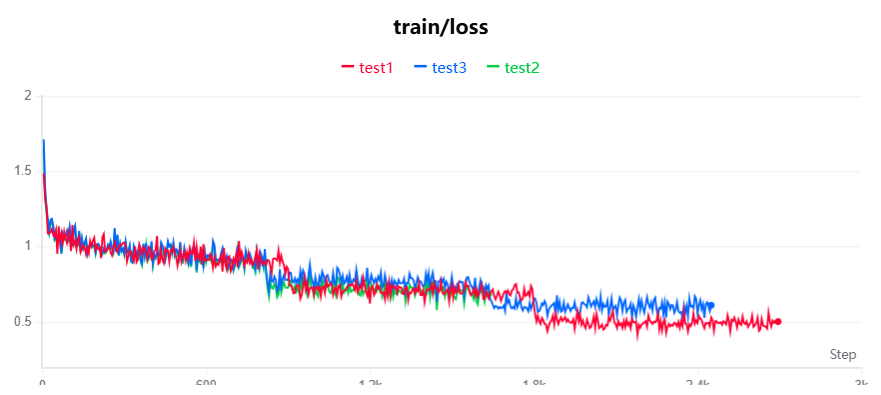
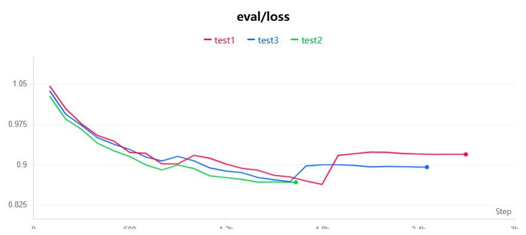
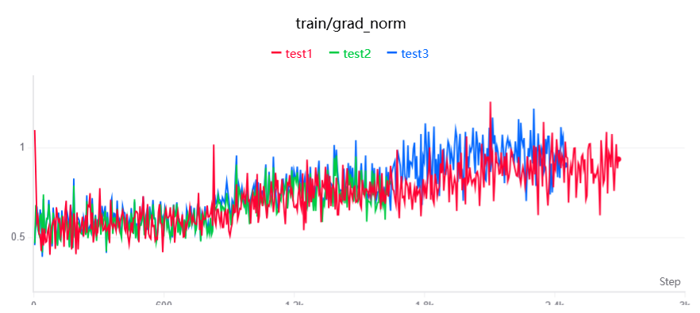
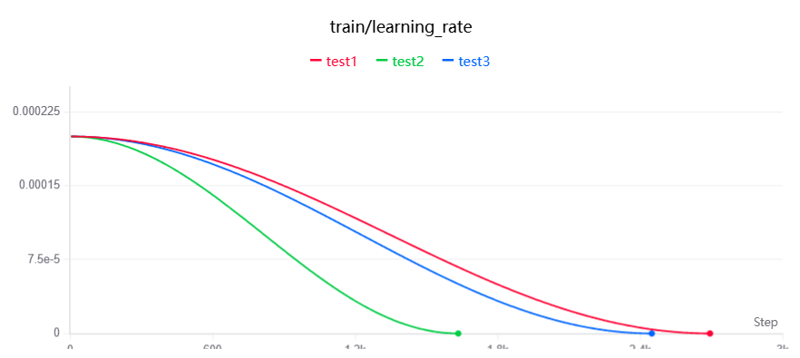
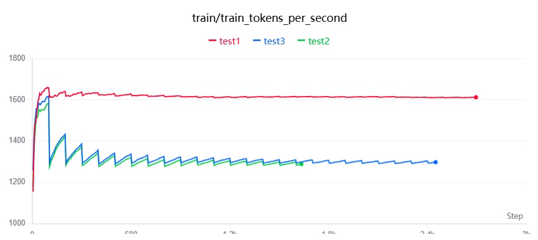
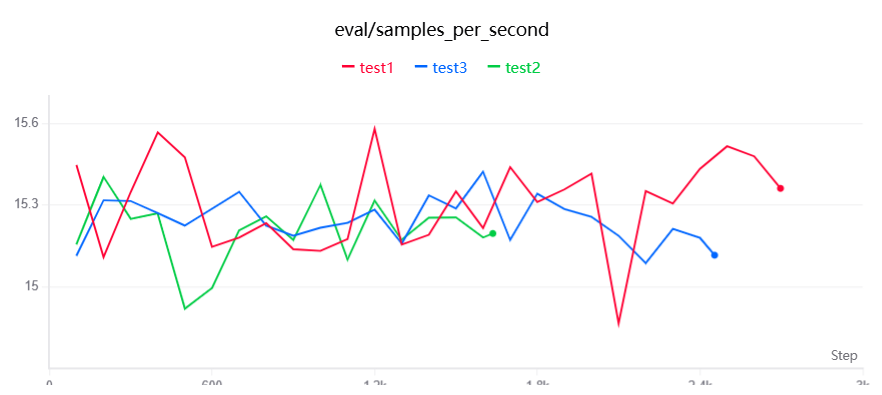
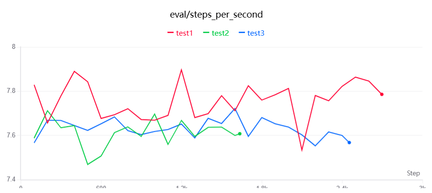

# 矿山安全领域 QLoRA 微调 Qwen2.5-7B-Instruct

> 基于 [Qwen2.5-7B-Instruct](https://huggingface.co/Qwen/Qwen2.5-7B-Instruct)，使用 QLoRA 在矿山安全领域进行领域微调。  
> 数据来源：《煤矿安全规程》（2025）和《金属非金属矿山安全规程》（2020）。  
> 训练框架：[Llama-Factory](https://github.com/hiyouga/LLaMA-Factory) | 实验追踪：[SwanLab](https://swanlab.cn/@DateDefier/llamafactory/runs)

---

## 1. 效果展示

微调前后使用 15 道矿山安全领域专业测试题进行对比，由 GPT-5.5 基于规程原文进行盲评：

| 维度 | 原模型 (Answer1) | 微调后 (Answer2) |
|------|-----------------|-----------------|
| 规程数值准确性 | 较差，常编造公式和参数 | 更接近规程硬性指标 |
| 综合场景覆盖 | 更全面，框架更完整 | 偏简略，但更安全 |
| 虚构数据风险 | 高（编造经验公式、单位错误） | 较低 |
| **GPT-5.5 盲评胜负** | **胜 6 题** | **胜 8 题，平 1 题** |

**典型对比示例：**

**问题：** 井下双轨运输大巷的允许风速范围是多少？

| | 原模型回答 | 微调后回答 |
|---|-----------|-----------|
| 风速范围 | 0.15 ~ 6 m/s（笼统套用） | 1.0 ~ 8 m/s（更符合架线电机车巷道规程） |
| GPT-5.5 评价 | 适用范围混乱，规程数值不准确 | 数值更接近规程表 |

> 详细评估结果见 [Evaluation/](./Evaluation/) 目录，包含 15 道测试题和完整 GPT-5.5 盲评报告。

---

## 2. 项目亮点

- **高质量数据**：7265 条 QA 对，经 AI 自动评估（DeepSeek-R1）+ 人工筛选，过滤掉 5.66% 低质量数据
- **低成本训练**：4-bit NF4 量化 + LoRA，单张 GPU 仅需 1~1.5 小时完成训练
- **Chain-of-Thought**：训练数据包含 `<think>` 推理链，增强模型推理能力
- **系统性实验**：3 组对比实验探索 LoRA rank（8/16）和 epoch（2/3）的最优配置
- **完整评估流程**：微调前后对比 + GPT-5.5 盲评 + 5 维度专业评分

---

## 3. 方法流程

```
数据收集                   训练                    评估
┌─────────────────┐   ┌──────────────────┐   ┌──────────────────┐
│ PDF 规程文档      │   │ AutoDL 云 GPU     │   │ 15 道专业测试题    │
│       ↓          │   │       ↓           │   │       ↓           │
│ MinerU 转 Markdown│   │ QLoRA 4-bit 训练  │   │ GPT-5.5 盲评      │
│       ↓          │   │       ↓           │   │       ↓           │
│ Easy Dataset     │   │ Loss 曲线分析     │   │ 5 维度评分         │
│ 自动生成 QA       │   │       ↓           │   │       ↓           │
│       ↓          │   │ 模型导出          │   │ 结论分析           │
│ AI 质量评估+过滤   │   └──────────────────┘   └──────────────────┘
└─────────────────┘
```

**关键工具链接：**
| 工具 | 用途 | 链接 |
|------|------|------|
| MinerU | PDF 转 Markdown | [在线平台](https://mineru.net/OpenSourceTools/Extractor) |
| Easy Dataset | QA 数据集生成 | [使用教程](https://zhuanlan.zhihu.com/p/29942660863) |
| Llama-Factory | 微调框架 | [GitHub](https://github.com/hiyouga/LLaMA-Factory) |
| AutoDL | 云 GPU 服务器 | [官网](https://www.autodl.com) |
| SwanLab | 实验追踪 | [实验面板](https://swanlab.cn/@DateDefier/llamafactory/runs) |

---

## 4. 项目结构

```
QLoRA/
├── data/
│   ├── PDF/              # 原始规程 PDF 文件
│   ├── Markdown/         # MinerU 转换后的 Markdown 文件
│   └── JSON/
│       ├── mine_safety_data.json   # 训练数据集（Alpaca 格式）
│       └── dataset_info.json       # Llama-Factory 数据集注册
├── Config and Index/     # 三次实验的配置和训练指标
│   ├── test1-config.csv / test1-index.csv
│   ├── test2-config.csv / test2-index.csv
│   └── test3-config.csv / test3-index.csv
├── Evaluation/           # 微调前后评估
│   ├── Question.md       # 15 道测试题
│   ├── Answer1.md        # 原模型回答
│   ├── Answer2.md        # 微调后回答
│   ├── Prompt.md         # GPT-5.5 评测 Prompt
│   └── Evaluation Result.md  # 完整评测报告
├── Export/               # 导出的模型权重（.tar）
├── figure/               # 训练 Loss 曲线图
├── docs/                 # 学习笔记与参考资料
│   ├── training-params-guide.md   # 训练参数详解（含 VRAM 估算）
│   ├── param-reference.md         # 参数快速参考表
│   ├── evaluation-questions.md    # 15 道评估测试题
│   └── baseline-tutorial.md       # Baseline 跑通教程
└── README.md
```

---

## 5. 数据集说明

### 数据来源

| 规程 | 年份 | 链接 |
|------|------|------|
| 《金属非金属矿山安全规程》 | 2020 | [原文链接](https://xj.chinamine-safety.gov.cn/web/searchInfo.shtml?infoid=906590871600678) |
| 《煤矿安全规程》 | 2025 | [原文链接](https://www.mem.gov.cn/gk/zfxxgkpt/fdzdgknr/gz11/202508/P020250804637946571624.pdf) |

### 数据处理流程

1. **PDF 转 Markdown**：使用 MinerU 在线平台将两部规程 PDF 转为结构化 Markdown
2. **QA 自动生成**：使用 Easy Dataset 进行文档分块、问题提取和答案生成
   - 分块策略：基于 Markdown 结构，最小 100 字 / 最大 2000 字
   - 使用 DeepSeek-R1-0528-Qwen3-8B 作为生成模型
3. **质量评估**：AI 自动评分（满分 5 分），过滤 3.5 分以下的低质量 QA 对
4. **结果**：原始 7874 条 → 过滤后 **7265 条**高质量 QA 对

### 数据格式

Alpaca 格式，包含 `<think>` 推理链：

```json
{
  "instruction": "煤矿企业需要向驻地矿山安全监察机构提交哪些材料？",
  "input": "",
  "output": "<think>\n推理过程...\n</think>\n\n正式回答...",
  "system": "你是一位精通中国矿山安全法律法规的资深专家..."
}
```

---

## 6. 训练配置

### 基座模型

[Qwen/Qwen2.5-7B-Instruct](https://huggingface.co/Qwen/Qwen2.5-7B-Instruct) — 7.6B 参数，28 层 Transformer

### QLoRA 参数

| 参数 | 值 |
|------|-----|
| 量化 | 4-bit NF4 (BitsAndBytes) + 双重量化 |
| LoRA rank | 16 |
| LoRA alpha | 32 |
| LoRA dropout | 0.1 |
| Target modules | q_proj, v_proj, k_proj, o_proj, gate_proj, up_proj, down_proj |

### 训练参数

| 参数 | 值 |
|------|-----|
| 学习率 | 2e-4 |
| LR Scheduler | Cosine |
| Epochs | 3 |
| Batch size | 2 × 4（梯度累积） = 8 |
| Max sequence length | 2048 |
| Optimizer | AdamW |
| bf16 | True |
| 随机种子 | 42 |
| 训练环境 | AutoDL 云 GPU |

### 参数选择分析

| 参数 | 选择理由 |
|------|----------|
| **LoRA rank=16** | 对比 Test 1（rank=16）和 Test 3（rank=8），在相同 epoch=3 条件下，rank=16 的 eval loss（0.9198）高于 rank=8（0.8960），但这并非 rank 本身的问题——而是 epoch=3 导致过拟合掩盖了 rank=16 的优势。当 epoch 降为 2（Test 2），rank=16 取得了三组实验中最低的 eval loss（0.8679），说明更高的 rank 在合适训练轮数下有更强的表达能力。 |
| **LoRA alpha=32** | 通常设为 rank 的 2 倍，这是 LoRA 社区的通用实践。alpha 控制低秩适配器的缩放系数，alpha/rank=2 保证了适配器对原始权重的有效影响幅度。 |
| **Epochs=2（最优）** | 三组实验中，Test 1 和 Test 3 均在第 3 个 epoch 出现 eval loss 反弹（从 ~0.86 升至 ~0.92），这是典型的过拟合信号。Test 2 在 epoch=2 时及时停止，eval loss 最低且训练时间最短。**结论：本数据集的最佳训练轮数为 2 轮。** |
| **Learning rate=2e-4** | LoRA 微调的常用起点值。相比全参数微调（通常 5e-5），LoRA 仅更新低秩适配器，需要更大学习率才能快速收敛。cosine scheduler 会在训练后期自动衰减至接近 0，避免后期震荡。 |
| **Cutoff length=2048** | 与 Easy Dataset 的最大分割长度（2000 字符）匹配。统计显示 99%+ 的训练数据在 2048 token 以内，既能覆盖绝大多数样本，又不会因过长序列导致显存爆炸。 |
| **Batch size=2×4=8** | 单 GPU 显存有限，per_device_batch_size=2 是 4-bit 量化 + 2048 序列长度下的安全值；gradient_accumulation_steps=4 实现等效 batch=8，兼顾训练稳定性和显存限制。 |

> 完整训练配置：[Test 1](Config%20and%20Index/test1-config.csv) | [Test 2](Config%20and%20Index/test2-config.csv) | [Test 3](Config%20and%20Index/test3-config.csv)

---

## 7. 实验结果

### 三组实验对比

| 实验 | LoRA Rank | Alpha | Epochs | Eval Loss | 训练时长 |
|------|-----------|-------|--------|-----------|---------|
| Test 1 | 16 | 32 | 3 | 0.9198 | ~83 min |
| **Test 2** | **16** | **32** | **2** | **0.8679** | **~64 min** |
| Test 3 | 8 | 16 | 3 | 0.8960 | ~95 min |

**结论**：Test 2（rank=16, epoch=2）取得了最低的 eval loss，同时训练时间最短。3 个 epoch 出现了过拟合（eval loss 在 epoch 2 后反弹）。

### Loss 曲线

| Training Loss | Eval Loss | Gradient Norm |
|:---:|:---:|:---:|
|  |  |  |

**图表分析：**

- **Training Loss**：三组实验的训练 loss 均稳定下降，无明显震荡，说明学习率和 batch size 配置合理。Test 1 下降最快（rank=16, epoch=3），但最低 train loss 并不意味着最好的泛化能力。
- **Eval Loss**：核心观察——Test 2（蓝色线）在 epoch 2 结束时取得最低点（0.8679），而 Test 1 和 Test 3 在进入第 3 个 epoch 后 eval loss 明显反弹（从 ~0.86 升至 ~0.92），这是**过拟合的典型信号**。这直接证明了 epoch=2 是本数据集的最佳停止点。
- **Gradient Norm**：训练初期梯度范数波动较大（模型在快速学习），后期趋于平稳并收敛到较低水平，说明模型参数更新逐渐稳定，训练过程健康。

> 完整训练指标：[Test 1](Config%20and%20Index/test1-index.csv) | [Test 2](Config%20and%20Index/test2-index.csv) | [Test 3](Config%20and%20Index/test3-index.csv)

### 详细训练指标

| Learning Rate | Tokens per Second | Eval Samples/Step | Eval Steps/Second |
|:---:|:---:|:---:|:---:|
|  |  |  |  |

**图表分析：**

- **Learning Rate**：cosine scheduler 的典型衰减曲线——从初始值 2e-4 逐步衰减至接近 0。这种先快后慢的衰减策略让模型在训练初期快速学习、后期精细调整。
- **Tokens per Second**：反映训练吞吐量。不同 rank 配置对吞吐量的影响有限，主要瓶颈在于序列长度和 batch size。
- **Eval Samples/Step & Steps/Second**：验证集评估效率指标，用于监控评估阶段的计算开销。各组实验差异不大，说明评估流程稳定。

> 完整训练指标：[Test 1](Config%20and%20Index/test1-index.csv) | [Test 2](Config%20and%20Index/test2-index.csv) | [Test 3](Config%20and%20Index/test3-index.csv)

### 交互式实验追踪

> **[SwanLab 实验面板](https://swanlab.cn/@DateDefier/llamafactory/runs)** — 支持鼠标悬停查看每个 step 的详细参数，包含完整的 loss 曲线、学习率、梯度范数等交互式图表。

---

## 8. 评估结果

### 测试题设计

15 道测试题覆盖 3 个维度：

| 类别 | 题目数 | 考察能力 |
|------|--------|---------|
| 核心尺寸计算与工程设计 | 5 | 定量对齐能力 |
| 矿山通风与安全规程 | 5 | 领域知识精确度 |
| 实际生产业务与综合场景 | 5 | 逻辑推理与实际应用 |

### GPT-5.5 盲评结论

评测维度：规程符合性、准确性、完整性、实用性、表达质量。

| 指标 | 原模型 (Answer1) | 微调后 (Answer2) |
|------|-----------------|-----------------|
| 获胜题数 | 6 | 8 |
| 平局 | 1 | 1 |
| 规程数值 | 常编造公式和参数，单位错误 | 更接近规程硬性指标 |
| 综合场景 | 覆盖面广，框架完整 | 偏简略但更安全 |
| 主要风险 | "看似详细但夹杂编造参数" | "看似简洁但依据不足" |

**整体结论**：微调后模型 (Answer2) 略优于原模型 (Answer1)，在更多题目中避免了明显错误的计算和矛盾尺寸。但两者都不能直接用于真实矿山安全生产场景，必须经规程原文复核后才能使用。

> 15 道题逐题评测汇总见 [评测汇总表格](./Evaluation/Evaluation%20Result.md#评测汇总)，完整评测报告见 [Evaluation/Evaluation Result.md](./Evaluation/Evaluation%20Result.md)

---

## 9. 使用方式

### 环境要求

```bash
pip install transformers>=5.6.0 torch peft>=0.18.1 bitsandbytes
```

### 加载模型

```python
from transformers import AutoModelForCausalLM, AutoTokenizer

model_path = "your-username/Qwen2.5-7B-Instruct-mine-safety"  # Hugging Face 模型路径
tokenizer = AutoTokenizer.from_pretrained(model_path, trust_remote_code=True)
model = AutoModelForCausalLM.from_pretrained(
    model_path,
    device_map="auto",
    trust_remote_code=True
)

prompt = "在深度 800 米的煤矿中，设计一条双轨矿山运输巷道时，确定断面尺寸的核心依据是什么？"
messages = [
    {"role": "system", "content": "你是一位精通中国矿山安全法律法规的资深专家。"},
    {"role": "user", "content": prompt}
]
text = tokenizer.apply_chat_template(messages, tokenize=False, add_generation_prompt=True)
inputs = tokenizer(text, return_tensors="pt").to(model.device)
outputs = model.generate(**inputs, max_new_tokens=1024)
print(tokenizer.decode(outputs[0], skip_special_tokens=True))
```

---

## 10. 局限性与未来工作

### 当前局限

- 模型在综合场景题（应急预案、施工交底等）上仍有提升空间
- 部分回答存在"看似确定但依据不足"的问题
- 不能直接用于真实矿山安全生产场景，需经规程原文复核

### 未来方向

- 扩充数据集，增加更多规程和实际案例
- 尝试 GRPO（Group Relative Policy Optimization）强化学习
- 部署 Gradio Web Demo 进行交互式体验
- 探索更大模型（14B/32B）的微调效果

---

## 11. 详细笔记

本项目的完整学习笔记和参考资料存放在 [`docs/`](./docs/) 目录下，适合初学者参考：

| 文档 | 内容说明 |
|------|----------|
| [训练参数详解](docs/training-params-guide.md) | 各核心参数的作用、通俗类比、显存估算方法、liger_kernel 和 DeepSpeed 优化技巧 |
| [参数快速参考表](docs/param-reference.md) | 由 DeepSeek-v4-Pro 生成的参数速查表，涵盖 QLoRA/LoRA/训练超参的含义与建议 |
| [评估测试题](docs/evaluation-questions.md) | 15 道矿山安全领域专业测试题，覆盖尺寸计算、通风规程、综合场景 3 个维度 |
| [Baseline 跑通教程](docs/baseline-tutorial.md) | 从数据处理到模型导出的完整 step-by-step 教程，包含环境搭建和踩坑记录 |

---

## 12. 致谢

| 工具/平台 | 用途 |
|-----------|------|
| [Llama-Factory](https://github.com/hiyouga/LLaMA-Factory) | 微调框架 |
| [Qwen2.5](https://github.com/QwenLM/Qwen2.5) | 基座模型 |
| [Easy Dataset](https://zhuanlan.zhihu.com/p/29942660863) | QA 数据集生成 |
| [SwanLab](https://swanlab.cn/@DateDefier/llamafactory/runs) | 实验追踪 |
| [AutoDL](https://www.autodl.com) | 云 GPU 服务器 |
| [MinerU](https://mineru.net/OpenSourceTools/Extractor) | PDF 转 Markdown |

---

## 13. 许可证

本项目使用的基座模型 Qwen2.5-7B-Instruct 遵循 [Qwen Research License](https://github.com/QwenLM/Qwen2.5/blob/main/LICENSE)。训练数据来源于国家矿山安全相关法规，仅供研究与学习使用。
