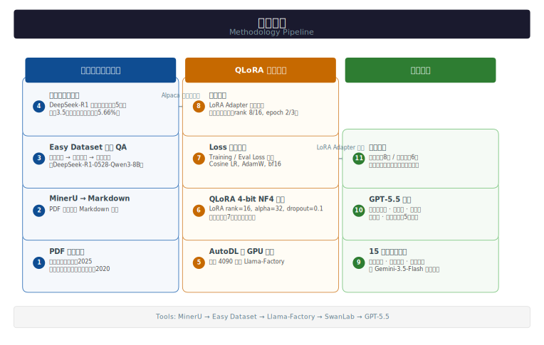

# 矿山安全领域 QLoRA 微调 Qwen2.5-7B-Instruct

> 用 QLoRA 对 [Qwen2.5-7B-Instruct](https://huggingface.co/Qwen/Qwen2.5-7B-Instruct) 做矿山安全领域微调。
> 训练数据来自《煤矿安全规程》（2025）和《金属非金属矿山安全规程》（2020）。
> 框架：[Llama-Factory](https://github.com/hiyouga/LLaMA-Factory) | 实验追踪：[SwanLab](https://swanlab.cn/@DateDefier/llamafactory/runs)

---

## 1. 效果展示

微调前后使用 15 道矿山安全领域专业测试题进行对比，由 GPT-5.5 基于规程原文进行盲评：

| 维度 | 原模型 (Answer1) | 微调后 (Answer2) |
|------|-----------------|-----------------|
| 规程数值准确性 | 较差，常编造公式和参数 | 更接近规程硬性指标 |
| 综合场景覆盖 | 更全面，框架更完整 | 偏简略，但更安全 |
| 虚构数据风险 | 高（编造经验公式、单位错误） | 较低 |
| **GPT-5.5 盲评胜负** | **胜 6 题** | **胜 8 题，平 1 题** |

**典型对比示例：**

**问题：** 井下双轨运输大巷的允许风速范围是多少？

| | 原模型回答 | 微调后回答 |
|---|-----------|-----------|
| 风速范围 | 0.15 ~ 6 m/s（笼统套用） | 1.0 ~ 8 m/s（更符合架线电机车巷道规程） |
| GPT-5.5 评价 | 适用范围混乱，规程数值不准确 | 数值更接近规程表 |

> 详细评估结果见 [Evaluation/](./Evaluation/) 目录，包含 15 道测试题和完整 GPT-5.5 盲评报告。

---

## 2. 项目概览

- 7265 条 QA 对，经 DeepSeek-R1 自动评分后过滤掉 5.66% 低质量数据
- 4-bit NF4 量化 + LoRA，单张 GPU 训练 1~1.5 小时
- 训练数据含 `<think>` 推理链
- 跑了 3 组对比实验（rank 8/16，epoch 2/3），找到最优配置
- 用 GPT-5.5 做盲评，15 道专业题、5 个评分维度

---

## 3. 方法流程



**工具链接：**
| 工具 | 用途 | 链接 |
|------|------|------|
| MinerU | PDF 转 Markdown | [在线平台](https://mineru.net/OpenSourceTools/Extractor) |
| Easy Dataset | QA 数据集生成 | [使用教程](https://zhuanlan.zhihu.com/p/29942660863) |
| Llama-Factory | 微调框架 | [GitHub](https://github.com/hiyouga/LLaMA-Factory) |
| AutoDL | 云 GPU 服务器 | [官网](https://www.autodl.com) |
| SwanLab | 实验追踪 | [实验面板](https://swanlab.cn/@DateDefier/llamafactory/runs) |

---

## 4. 项目结构

```
QLoRA/
├── data/
│   ├── PDF/              # 原始规程 PDF 文件
│   ├── Markdown/         # MinerU 转换后的 Markdown 文件
│   └── JSON/
│       ├── mine_safety_data.json   # 训练数据集（Alpaca 格式）
│       └── dataset_info.json       # Llama-Factory 数据集注册
├── Config and Index/     # 三次实验的配置和训练指标
│   ├── test1-config.csv / test1-index.csv
│   ├── test2-config.csv / test2-index.csv
│   └── test3-config.csv / test3-index.csv
├── Evaluation/           # 微调前后评估
│   ├── Question.md       # 15 道测试题
│   ├── Answer1.md        # 原模型回答
│   ├── Answer2.md        # 微调后回答
│   ├── Prompt.md         # GPT-5.5 评测 Prompt
│   └── Evaluation Result.md  # 完整评测报告
├── Export/               # 导出的模型权重（.tar）
├── figure/               # 训练 Loss 曲线图
├── docs/                 # 学习笔记与参考资料
│   ├── training-params-guide.md   # 训练参数详解（含 VRAM 估算）
│   ├── param-reference.md         # 参数快速参考表
│   ├── evaluation-questions.md    # 15 道评估测试题
│   └── baseline-tutorial.md       # Baseline 跑通教程
└── README.md
```

---

## 5. 数据集说明

### 数据来源

| 规程 | 年份 | 链接 |
|------|------|------|
| 《金属非金属矿山安全规程》 | 2020 | [原文链接](https://xj.chinamine-safety.gov.cn/web/searchInfo.shtml?infoid=906590871600678) |
| 《煤矿安全规程》 | 2025 | [原文链接](https://www.mem.gov.cn/gk/zfxxgkpt/fdzdgknr/gz11/202508/P020250804637946571624.pdf) |

### 数据处理流程

1. **PDF 转 Markdown**：使用 MinerU 在线平台将两部规程 PDF 转为结构化 Markdown
2. **QA 自动生成**：使用 Easy Dataset 进行文档分块、问题提取和答案生成
   - 分块策略：基于 Markdown 结构，最小 100 字 / 最大 2000 字
   - 使用 DeepSeek-R1-0528-Qwen3-8B 作为生成模型
3. **质量评估**：AI 自动评分（满分 5 分），过滤 3.5 分以下的低质量 QA 对
4. **结果**：原始 7874 条 → 过滤后 **7265 条**高质量 QA 对

> 完整数据集已上传至 Hugging Face：[FateDefier/MineSafety-QA-Dataset](https://huggingface.co/datasets/FateDefier/MineSafety-QA-Dataset)

### 数据格式

Alpaca 格式，包含 `<think>` 推理链：

```json
{
  "instruction": "煤矿企业需要向驻地矿山安全监察机构提交哪些材料？",
  "input": "",
  "output": "<think>\n推理过程...\n</think>\n\n正式回答...",
  "system": "你是一位精通中国矿山安全法律法规的资深专家..."
}
```

---

## 6. 训练配置

### 基座模型

[Qwen/Qwen2.5-7B-Instruct](https://huggingface.co/Qwen/Qwen2.5-7B-Instruct) — 7.6B 参数，28 层 Transformer

### QLoRA 参数

| 参数 | 值 |
|------|-----|
| 量化 | 4-bit NF4 (BitsAndBytes) + 双重量化 |
| LoRA rank | 16 |
| LoRA alpha | 32 |
| LoRA dropout | 0.1 |
| Target modules | q_proj, v_proj, k_proj, o_proj, gate_proj, up_proj, down_proj |

### 训练参数

| 参数 | 值 |
|------|-----|
| 学习率 | 2e-4 |
| LR Scheduler | Cosine |
| Epochs | 3 |
| Batch size | 2 × 4（梯度累积） = 8 |
| Max sequence length | 2048 |
| Optimizer | AdamW |
| bf16 | True |
| 随机种子 | 42 |
| 训练环境 | AutoDL 云 GPU |

### 参数选择分析

| 参数 | 选择理由 |
|------|----------|
| **4-bit NF4 + 双重量化** | NF4（NormalFloat4）是 QLoRA 论文提出的量化格式，针对正态分布权重设计，比普通 INT4 更省精度。双重量化对量化常数本身再做一次 8-bit 量化，进一步压缩显存。 |
| LoRA rank=16 | Test 1（r16, e3）和 Test 3（r8, e3）对比，同样跑 3 个 epoch，rank=16 的 eval loss 反而更高（0.9198 vs 0.8960）。但这不是 rank 的问题——是 epoch=3 过拟合把 rank=16 的优势吃掉了。把 epoch 降到 2（Test 2），**rank=16 拿到了三组最低的 eval loss（0.8679）**。 |
| LoRA alpha=32 | 设为 rank 的 2 倍，LoRA 社区的通用做法。 |
| LoRA dropout=0.1 | 防过拟合。0.1 是常用值，太大会拖慢收敛。 |
| **Target modules（7 个）** | 默认只加 q_proj/v_proj，本项目加上了 k_proj/o_proj/gate_proj/up_proj/down_proj，**覆盖所有线性层**。QLoRA 论文实验表明，对所有线性层施加 LoRA 比只加 attention 投影效果更好，rank 可以更低。 |
| Epochs=2（最优） | Test 1 和 Test 3 都在第 3 个 epoch 出现 eval loss 反弹（~0.86 → ~0.92），过拟合信号很明显。**Test 2 在 epoch=2 停下来，loss 最低，训练时间也最短。** |
| Learning rate=2e-4 | LoRA 只更新低秩适配器，比全参数微调需要更大学习率。2e-4 是常见起点，cosine scheduler 后期会自动衰减到接近 0。 |
| Cosine LR scheduler | 先快后慢衰减，比线性衰减更平滑。 |
| Optimizer=AdamW | LoRA 微调的默认选择，weight decay 正则化配合 dropout 一起防过拟合。 |
| bf16=True | 混合精度训练，bf16 比 fp16 的数值范围更大（不容易溢出），在 Ampere 及以上 GPU 上效率和 fp16 相当。 |
| Cutoff length=2048 | 和 Easy Dataset 的最大分块长度（2000 字符）对齐。99%+ 的训练数据在 2048 token 以内。 |
| Batch size=2×4=8 | 单 GPU 显存有限，per_device_batch_size=2 是 4-bit 量化下的安全值，gradient_accumulation=4 凑成等效 batch=8。 |
| 随机种子=42 | 保证实验可复现，三组实验用同一个种子。 |

> 完整训练配置：[Test 1](Config%20and%20Index/test1-config.csv) | [Test 2](Config%20and%20Index/test2-config.csv) | [Test 3](Config%20and%20Index/test3-config.csv)

---

## 7. 实验结果

### 三组实验对比

| 实验 | LoRA Rank | Alpha | Epochs | Eval Loss | 训练时长 | Hugging Face |
|------|-----------|-------|--------|-----------|---------|-------------|
| Test 1 | 16 | 32 | 3 | 0.9198 | ~83 min | [链接](https://huggingface.co/FateDefier/Qwen2.5-7B-Instruct-LoRA-r16-e3) |
| **Test 2** | **16** | **32** | **2** | **0.8679** | **~64 min** | [链接](https://huggingface.co/FateDefier/Qwen2.5-7B-Instruct-LoRA-r16-e2) |
| Test 3 | 8 | 16 | 3 | 0.8960 | ~95 min | [链接](https://huggingface.co/FateDefier/Qwen2.5-7B-Instruct-LoRA-r8-e3) |

**结论**：**Test 2（rank=16, epoch=2）eval loss 最低，训练时间也最短**。跑 3 个 epoch 的两组都出现了过拟合。

### Loss 曲线

| Training Loss | Eval Loss | Gradient Norm |
|:---:|:---:|:---:|
|  |  |  |

**图表分析：**

- Training Loss：三组都稳定下降，没震荡，说明 lr 和 batch size 没问题。Test 1 下降最快但 eval loss 不是最优——**train loss 低不代表泛化好**。
- Eval Loss：**Test 2（蓝线）在 epoch 2 结束时最低（0.8679）**。Test 1 和 Test 3 进入第 3 个 epoch 后 loss 从 ~0.86 反弹到 ~0.92，过拟合了。**epoch=2 是本数据集的最佳停止点**。
- Gradient Norm：初期波动大（模型在快速学习），后期收敛到较低水平，训练过程正常。

> 完整训练指标：[Test 1](Config%20and%20Index/test1-index.csv) | [Test 2](Config%20and%20Index/test2-index.csv) | [Test 3](Config%20and%20Index/test3-index.csv)

### 详细训练指标

| Learning Rate | Tokens per Second | Eval Samples/Step | Eval Steps/Second |
|:---:|:---:|:---:|:---:|
|  |  |  |  |

**图表分析：**

- Learning Rate：cosine scheduler 的标准衰减曲线，从 2e-4 降到接近 0，先快后慢。
- Tokens per Second：训练吞吐量指标。不同 rank 配置影响不大，瓶颈在序列长度和 batch size。
- Eval Samples/Step & Steps/Second：评估阶段的效率指标，各组差异不大，流程稳定。

> 完整训练指标：[Test 1](Config%20and%20Index/test1-index.csv) | [Test 2](Config%20and%20Index/test2-index.csv) | [Test 3](Config%20and%20Index/test3-index.csv)

### 交互式实验追踪

> [SwanLab 实验面板](https://swanlab.cn/@DateDefier/llamafactory/runs) 可以鼠标悬停查看每个 step 的详细参数，包含 loss 曲线、学习率、梯度范数等交互式图表。

---

## 8. 评估结果

### 测试题设计

15 道测试题由 **Gemini-3.5-Flash** 根据 Markdown 规程文档自动生成，覆盖 3 个维度：

| 类别 | 题目数 | 考察能力 |
|------|--------|---------|
| 核心尺寸计算与工程设计 | 5 | 定量对齐能力 |
| 矿山通风与安全规程 | 5 | 领域知识精确度 |
| 实际生产业务与综合场景 | 5 | 逻辑推理与实际应用 |

### GPT-5.5 盲评结论

评分从规程符合性、准确性、完整性、实用性、表达质量五个维度打分。

| 指标 | 原模型 (Answer1) | 微调后 (Answer2) |
|------|-----------------|-----------------|
| 获胜题数 | 6 | 8 |
| 平局 | 1 | 1 |
| 规程数值 | 常编造公式和参数，单位错误 | 更接近规程硬性指标 |
| 综合场景 | 覆盖面广，框架完整 | 偏简略但更安全 |
| 主要风险 | "看似详细但夹杂编造参数" | "看似简洁但依据不足" |

**整体结论**：微调后模型（Answer2）比原模型好一些，在更多题目里没犯明显的计算错误。但**两个模型都不能直接拿去用，回答必须经过规程原文复核**。

> 15 道题逐题评测汇总见 [评测汇总表格](./Evaluation/Evaluation%20Result.md#评测汇总)，完整评测报告见 [Evaluation/Evaluation Result.md](./Evaluation/Evaluation%20Result.md)

---

## 9. 使用方式

### 环境搭建

用 Conda 管理环境（依赖列表见 [`requirements.txt`](./requirements.txt)）：

```bash
# 方式一：Conda（推荐）
conda env create -f environment.yml
conda activate llama-factory

# 方式二：pip
pip install -r requirements.txt
```

仅需推理时，安装核心依赖即可：

```bash
pip install transformers>=5.6.0 torch peft>=0.18.1 bitsandbytes
```

### LoRA Adapter 权重

三组实验的 LoRA adapter 权重已上传至 Hugging Face：

| 实验 | 链接 | 说明 |
|------|------|------|
| Test 1 (r16, e3) | [FateDefier/Qwen2.5-7B-Instruct-LoRA-r16-e3](https://huggingface.co/FateDefier/Qwen2.5-7B-Instruct-LoRA-r16-e3) | rank=16, epoch=3 |
| **Test 2 (r16, e2)** | [FateDefier/Qwen2.5-7B-Instruct-LoRA-r16-e2](https://huggingface.co/FateDefier/Qwen2.5-7B-Instruct-LoRA-r16-e2) | 最优配置 |
| Test 3 (r8, e3) | [FateDefier/Qwen2.5-7B-Instruct-LoRA-r8-e3](https://huggingface.co/FateDefier/Qwen2.5-7B-Instruct-LoRA-r8-e3) | rank=8, epoch=3 |

### 加载模型（LoRA Adapter）

以 Test 2 为例，用 PEFT 加载基座模型 + adapter：

```python
from transformers import AutoModelForCausalLM, AutoTokenizer
from peft import PeftModel

base_model = "Qwen/Qwen2.5-7B-Instruct"
adapter_path = "FateDefier/Qwen2.5-7B-Instruct-LoRA-r16-e2"

tokenizer = AutoTokenizer.from_pretrained(base_model, trust_remote_code=True)
model = AutoModelForCausalLM.from_pretrained(
    base_model,
    device_map="auto",
    trust_remote_code=True,
    torch_dtype="auto"
)
model = PeftModel.from_pretrained(model, adapter_path)

prompt = "在深度 800 米的煤矿中，设计一条双轨矿山运输巷道时，确定断面尺寸的核心依据是什么？"
messages = [
    {"role": "system", "content": "你是一位精通中国矿山安全法律法规的资深专家。"},
    {"role": "user", "content": prompt}
]
text = tokenizer.apply_chat_template(messages, tokenize=False, add_generation_prompt=True)
inputs = tokenizer(text, return_tensors="pt").to(model.device)
outputs = model.generate(**inputs, max_new_tokens=1024)
print(tokenizer.decode(outputs[0], skip_special_tokens=True))
```

---

## 10. 局限性

综合场景题（应急预案、施工交底等）的回答还不够好，部分答案"看起来确定但依据不足"。这个模型不能直接用于真实矿山安全生产，回答必须经规程原文复核。

后续可以考虑：扩充数据集、试 GRPO 强化学习、换更大的模型（14B/32B）。

---

## 11. 详细笔记

本项目的完整学习笔记和参考资料存放在 [`docs/`](./docs/) 目录下，适合初学者参考：

| 文档 | 内容说明 |
|------|----------|
| [训练参数详解](docs/training-params-guide.md) | 各核心参数的作用、通俗类比、显存估算方法、liger_kernel 和 DeepSpeed 优化技巧 |
| [参数快速参考表](docs/param-reference.md) | 由 DeepSeek-v4-Pro 生成的参数速查表，涵盖 QLoRA/LoRA/训练超参的含义与建议 |
| [评估测试题](docs/evaluation-questions.md) | 15 道测试题，覆盖尺寸计算、通风规程、综合场景 |
| [Baseline 跑通教程](docs/baseline-tutorial.md) | 从数据处理到模型导出的完整教程，含环境搭建和踩坑记录 |

---

## 12. 致谢

| 工具/平台 | 用途 |
|-----------|------|
| [Llama-Factory](https://github.com/hiyouga/LLaMA-Factory) | 微调框架 |
| [Qwen2.5](https://github.com/QwenLM/Qwen2.5) | 基座模型 |
| [Easy Dataset](https://zhuanlan.zhihu.com/p/29942660863) | QA 数据集生成 |
| [SwanLab](https://swanlab.cn/@DateDefier/llamafactory/runs) | 实验追踪 |
| [AutoDL](https://www.autodl.com) | 云 GPU 服务器 |
| [MinerU](https://mineru.net/OpenSourceTools/Extractor) | PDF 转 Markdown |

---

## 13. 许可证

本项目使用的基座模型 Qwen2.5-7B-Instruct 遵循 [Qwen Research License](https://github.com/QwenLM/Qwen2.5/blob/main/LICENSE)。训练数据来源于国家矿山安全相关法规，仅供研究与学习使用。
