# QLoRA 微调 Qwen2.5-7B-Instruct：矿山安全规程领域

基于《金属非金属矿山安全规程》和《煤矿安全规程》两份法规文件，对 Qwen2.5-7B-Instruct 进行 QLoRA 微调，使模型在矿山安全领域具备更强的专业问答能力。

---

## 目录

1. [项目流程总览](#1-项目流程总览)
2. [数据处理](#2-数据处理)
3. [云服务器环境搭建](#3-云服务器环境搭建)
4. [模型测试（微调前）](#4-模型测试微调前)
5. [训练参数与开始训练](#5-训练参数与开始训练)
6. [结果评估](#6-结果评估)
7. [模型导出与使用](#7-模型导出与使用)

---

## 1. 项目流程总览

```
数据采集 → PDF转Markdown → Easy Dataset生成QA → 数据清洗与评估 → 导出数据集
     ↓
AutoDL环境搭建 → 下载基座模型 → 模型测试(微调前)
     ↓
配置训练参数 → QLoRA训练 → 损失曲线分析
     ↓
模型导出 → 模型测试(微调后) → 对比评估
```

---

## 2. 数据处理

### 2.1 数据来源

| 文件 | 发布年份 | 下载地址 |
|------|---------|---------|
| 《金属非金属矿山安全规程》 | 2020 | [链接](https://xj.chinamine-safety.gov.cn/web/searchInfo.shtml?infoid=906590871600678) |
| 《煤矿安全规程》 | 2025 | [链接](https://www.mem.gov.cn/gk/zfxxgkpt/fdzdgknr/gz11/202508/P020250804637946571624.pdf) |

### 2.2 PDF 转 Markdown

使用 [MinerU 在线转换平台](https://mineru.net/OpenSourceTools/Extractor) 进行转换，如下图：


> **注意**：超过 200 页的 PDF 需分两次解析，然后合并为一份 Markdown 文件。

也可以通过接入 [MinerU API](https://mineru.net/apiManage/token) 配合 [Easy Dataset](https://zhuanlan.zhihu.com/p/29942660863) 自动完成：

1. 将鼠标移至「更多」→「项目配置」→「任务配置」：

   

2. 在「PDF 文件转换配置」的第一栏填写你的 API Key，**别忘记最后点保存配置**：

   

3. 来到「数据源」→「文件处理」，上传 PDF 文件，点击「MinerU API」解析，点击「上传并处理」。

> **这里使用第一种方法（在线平台）**。《煤矿安全规程》页数大于 200 页，需分两次解析，注意**解析后的 markdown 文档要合并成一份，之后再传入 Easy Dataset**。

### 2.3 Easy Dataset 参数配置

以下参数均基于矿山安全规程的文本特点（条文结构、短句多、专业性强）而设定：

| 参数 | 设置值 | 设置理由 |
|------|--------|---------|
| **文本分块类型** | Markdown（文本结构分块） | 保持法规条款完整性，按标题边界切分 |
| **最小长度** | 100 字符 | 避免过滤掉短小但关键的术语定义（如"进风巷"仅十几个字），最终可生成约 7874 个问题 |
| **最大分割长度** | 2000 字符 | 为微调时的 `max_length=2048` 留出空间，防止生成的 QA 被截断 |
| **多少字符生成一个问题** | 30 字符 | 条文短小，需要较低阈值才能生成足够数量的 QA 对 |
| **去除问号比例** | 30% | 模拟真实场景（如"解释瓦斯突出"），提高模型泛化能力 |
| **多轮对话设置** | 设置角色 | 可显著增强 QA 质量 |

详细参数配置如下图：

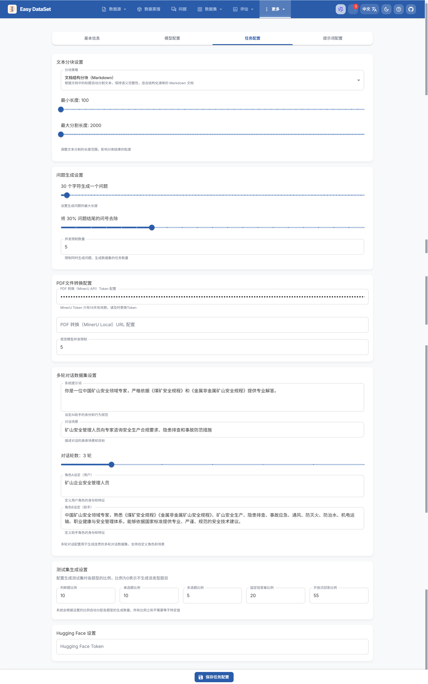

> **QA 对数量公式**：`QA 对数 = chunk长度 / 每问题字符数`

### 2.4 数据生成流程

> **以下所有任务中，若任务中断可继续上次进度。**

1. **数据清洗**：自动任务 → 自动数据清洗（使用 `deepseek-ai/DeepSeek-R1-0528-Qwen3-8B`，具体教程参考 [ConardLi 大佬的教程](https://zhuanlan.zhihu.com/p/29942660863)）

   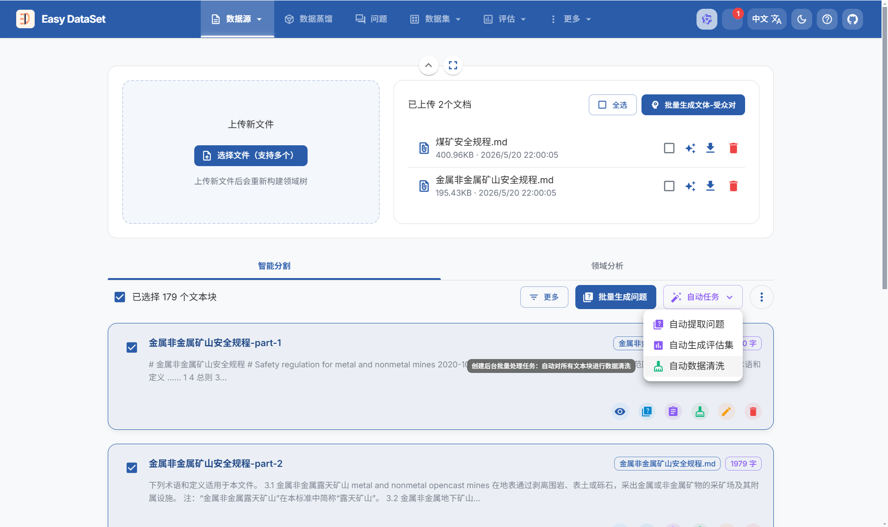

   可在后台任务中查看进度：

   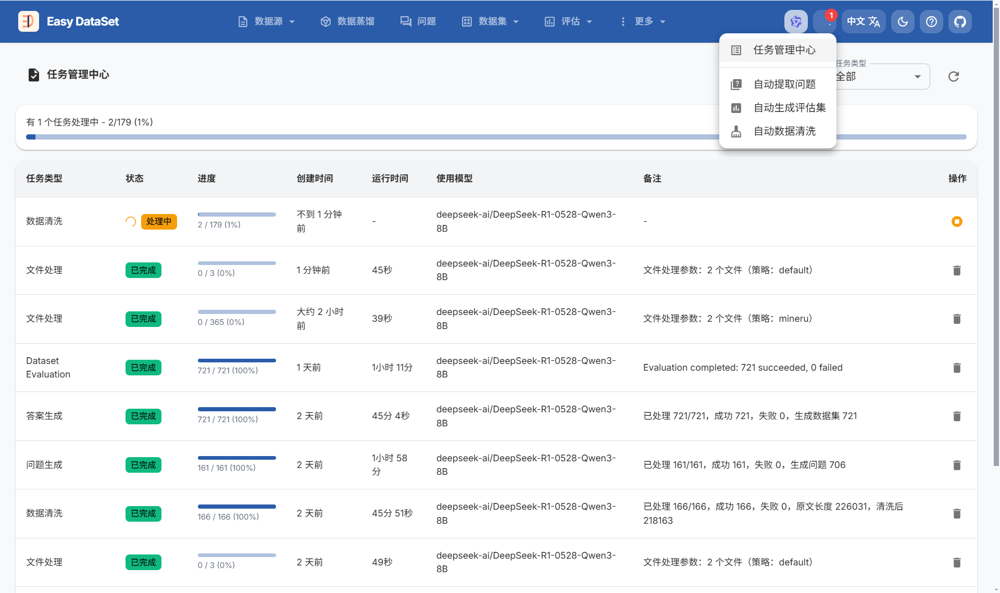

2. **问题生成**：全选所有文本块 → 点击「自动提取问题」

   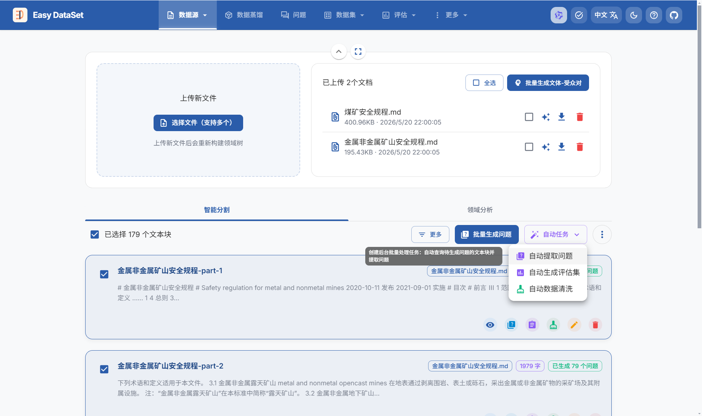

3. **答案生成**：进入「问题」选项卡，全选所有问题，根据情况生成单轮/多轮/图像问答数据集，这里生成**单轮对话数据集**

   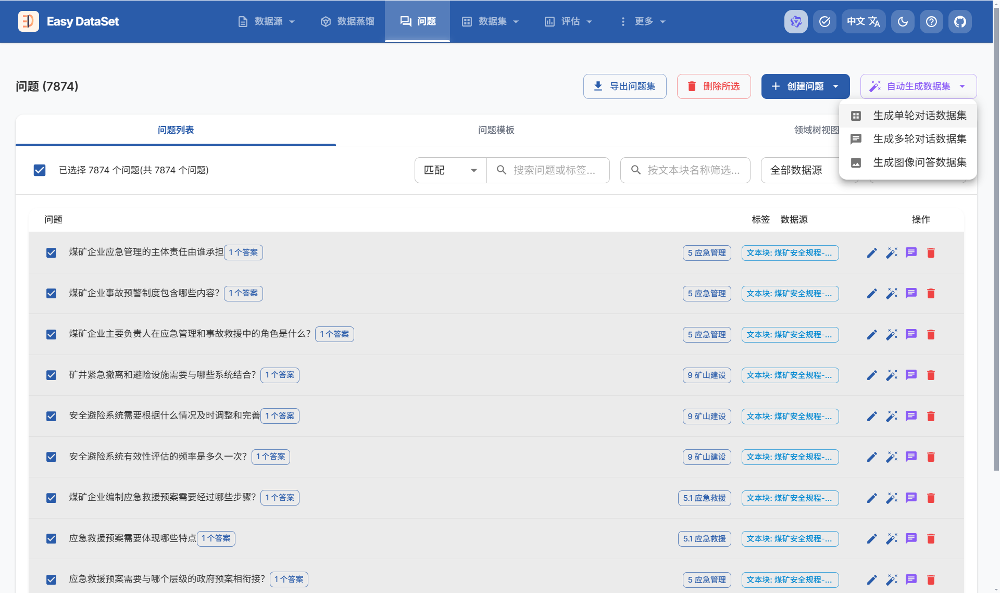

4. **AI 质量评估**：进入「数据集」选项卡，选择生成的数据集，点击「自动质量评估」

   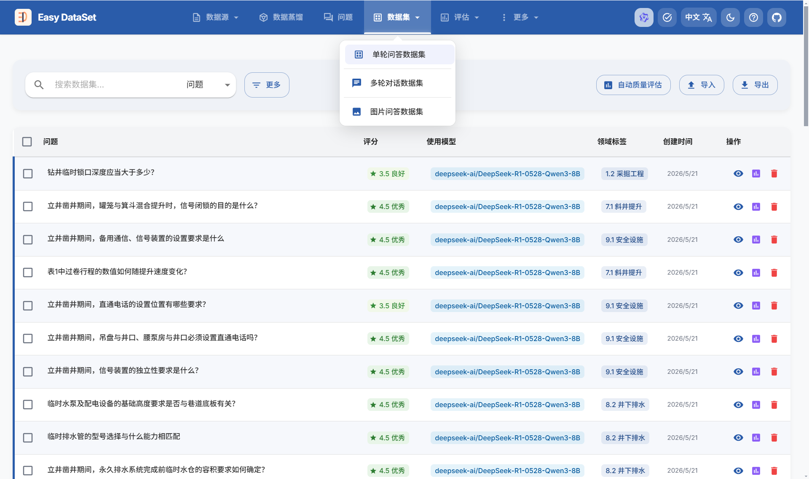

   所有后台任务如下：

   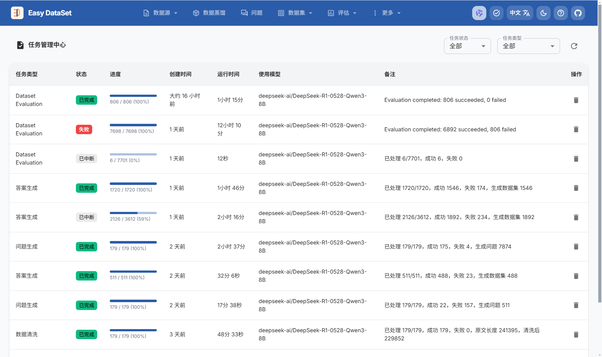

### 2.5 数据集质量审核与筛选

AI 评估后，重点关注 **评分 3.5 及以下** 的 QA 对。可点击「更多」按评分筛选数据集：

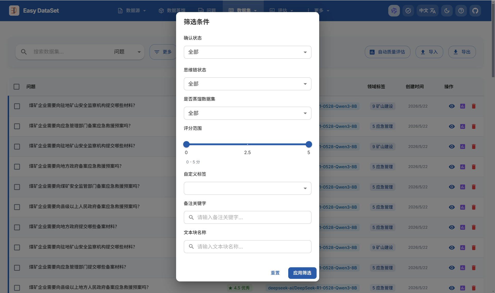

筛选评分 0-3.5 的数据集，共 436 个（约占 7701 个数据的 5.66%）：

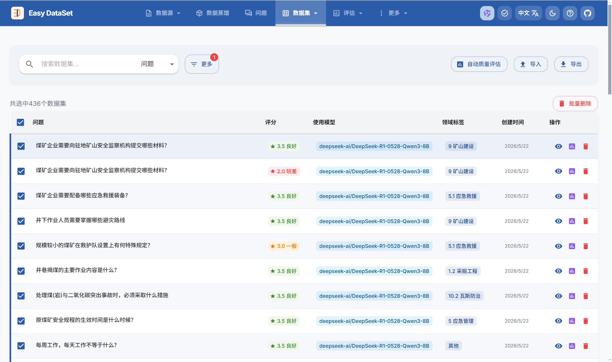

| 评分区间 | 处理方式 |
|---------|---------|
| 4.0 - 5.0 | 保留，直接用于微调 |
| 3.5 | 人工检查，根据情况修正或保留 |
| 2.0 - 3.0 | 重点关注，多为回答不完整或信息混淆，建议修正或舍弃 |
| 0 - 2.0 | 舍弃 |

筛选后保留 **约 7265 条** 高质量数据（4-5 分），用于微调。

### 2.6 导出配置

**步骤一**：筛选评分 4-5 的数据：

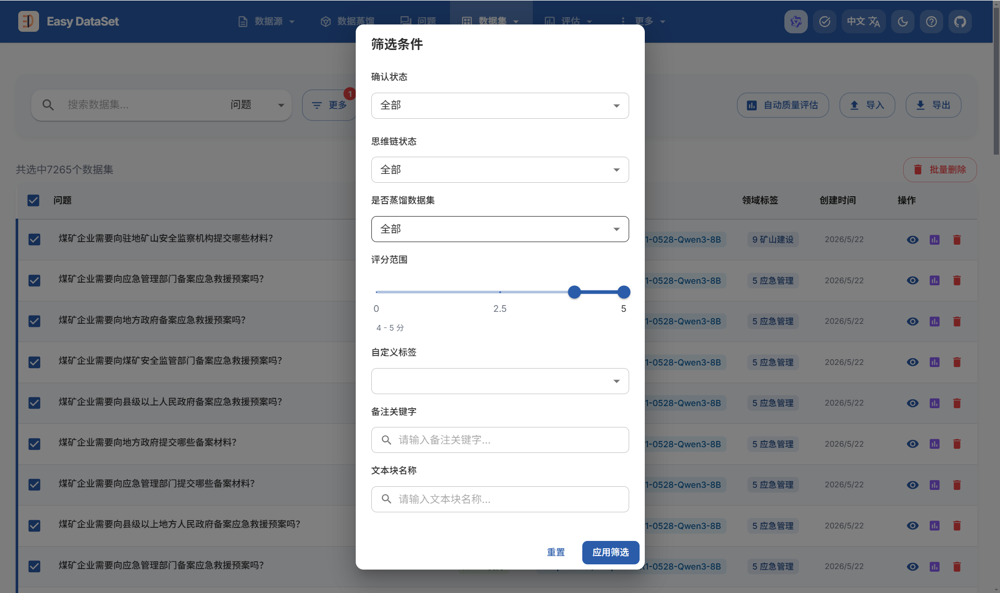

**步骤二**：点击右上角「导出」，配置导出参数：

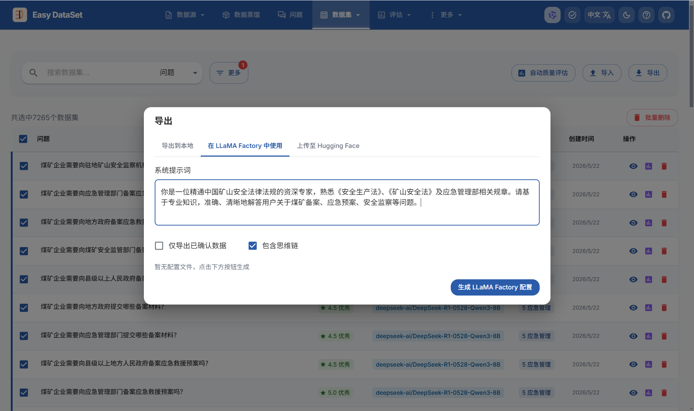

然后生成 LLaMA Factory 配置，点击「导出到本地」，确认导出即可（注意：提示词可以问 DeepSeek）。

> **Tips**：单轮对话数据集直接选用 `Alpaca` 数据集风格；多轮数据集建议选用 `ShareGPT` 数据集风格。

---

## 3. 云服务器环境搭建

### 3.1 平台

使用 AutoDL 云 GPU 服务器，详细教程参考[视频链接](https://www.bilibili.com/video/BV16xweznECG/?spm_id_from=333.1387.favlist.content.click&vd_source=8e1aeae9cf40ce80fc9b6afa0ca069ed)。

> **注意**：如果本地 VSCode 之前用 SSH 连接过 Github，记得把 config 注释掉，否则会和云服务器连接不成功。

### 3.2 Llama-Factory 安装

在本地完成 clone 并注册数据集后，通过 FileZilla 上传至云服务器的 `autodl-tmp` 数据盘：

**步骤一**：在本地任意创建一个名为 `Llama-Factory` 的文件夹，右键进入终端，执行：

```bash
git clone --depth 1 https://github.com/hiyouga/LlamaFactory.git
```

**步骤二**：进入 `Llama-Factory` 的 `data` 文件夹，把数据处理阶段最终导出的数据复制到该目录下（改名后的 JSON 文件，例如 `mine_safety_data.json`）：

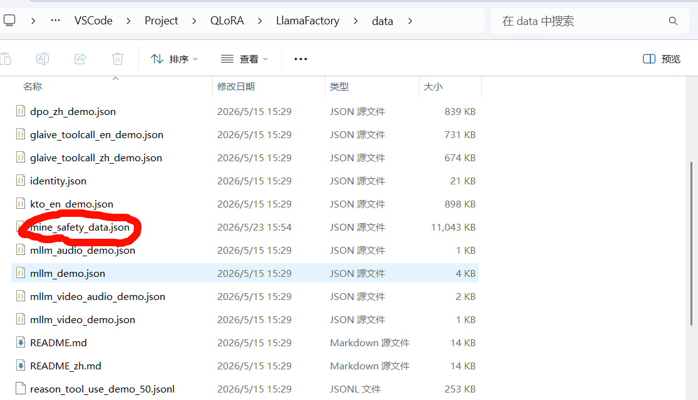

**步骤三**：打开 `data` 文件夹下的 `dataset_info.json`，在其中注册你的数据集（注意 `file_name` 要使用你的 JSON 文件名）：

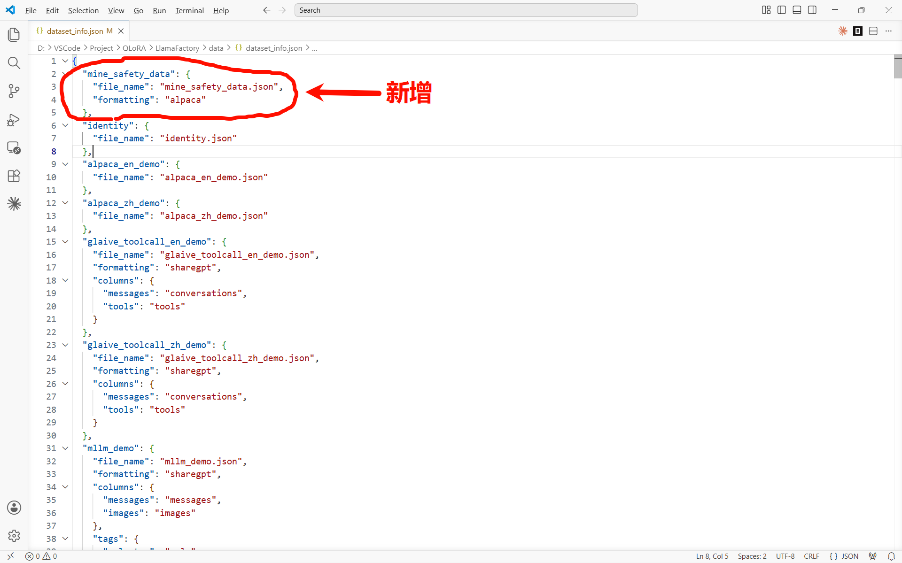

**然后把 `Llama-Factory` 文件夹压缩，便于传输。**

> **提示**：云服务器直接 `git clone` 可能因 TLS 报错失败（`GnuTLS recv error (-110)`），建议本地下载后通过 FileZilla 传输。

### 3.2.1 FileZilla 安装与使用

[FileZilla 下载地址](https://filezilla-project.org/download.php?type=client)（安装时勾选 Client 和 Language files 即可）。

连接时在左上角新建站点，选择 SSH 协议，填入云服务器信息：

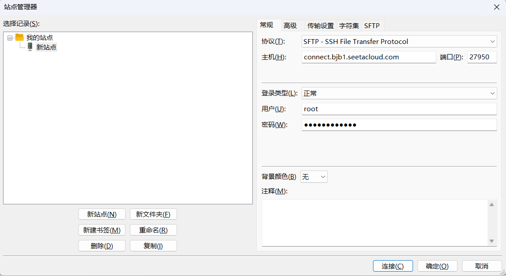

最后上传到云服务器的 `autodl-tmp` 目录，在该目录下解压：

```bash
unzip Llama-Factory.zip
```

### 3.3 Conda 环境与依赖安装

官方推荐版本如下：

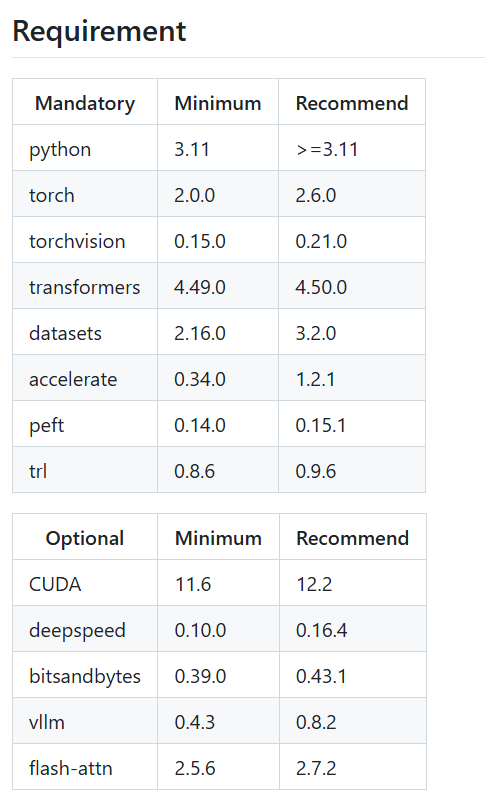

我们在 `Llama-Factory` 目录下创建 conda 虚拟环境。如果你不在该目录，先切换：

```bash
cd Llama-Factory
```

然后执行以下命令将 conda 安装到数据盘（之后迁移就不用配置环境了）：

```bash
mkdir -p /root/autodl-tmp/conda/pkgs
conda config --add pkgs_dirs /root/autodl-tmp/conda/pkgs
mkdir -p /root/autodl-tmp/conda/envs
conda config --add envs_dirs /root/autodl-tmp/conda/envs
```

创建 Python 虚拟环境（推荐官方版本 3.11）：

```bash
conda create -n llama-factory python=3.11 -y
```

> **注意**：一定要初始化 shell 环境，否则后续命令会报错：

```bash
conda init
source ~/.bashrc
```

激活环境并安装 LLaMA Factory 依赖：

```bash
conda activate llama-factory

pip install -e .
pip install -r requirements/metrics.txt
```

检验是否安装成功：

```bash
llamafactory-cli version
```

启动 LLaMA Factory 可视化微调界面（Gradio 驱动）：

```bash
llamafactory-cli webui
```

### 3.4 下载基座模型（HuggingFace）

```bash
mkdir -p /root/autodl-tmp/Hugging-Face

export HF_ENDPOINT=https://hf-mirror.com   # 国内镜像加速
export HF_HOME=/root/autodl-tmp/Hugging-Face

pip install -U huggingface_hub
hf download Qwen/Qwen2.5-7B-Instruct
```

---

## 4. 模型测试（微调前）

```bash
conda activate llama-factory
llamafactory-cli webui
# 若报错，改用：python -m llamafactory.cli webui
```

在 webui 中加载模型路径后进行对话测试，记录原始模型的回答作为微调前基线。

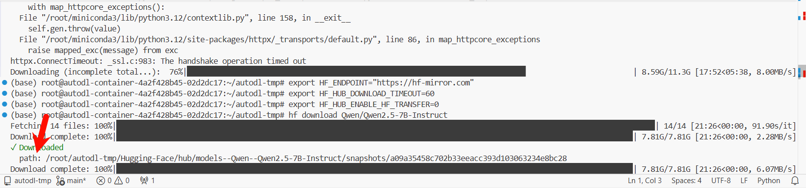

测试问题由 Gemini 3.5 Flash 根据数据集生成，共 20 个问题，用于之后进行原模型与微调后模型的对比。

---

## 5. 训练参数与开始训练

### 训练参数（webui 界面）

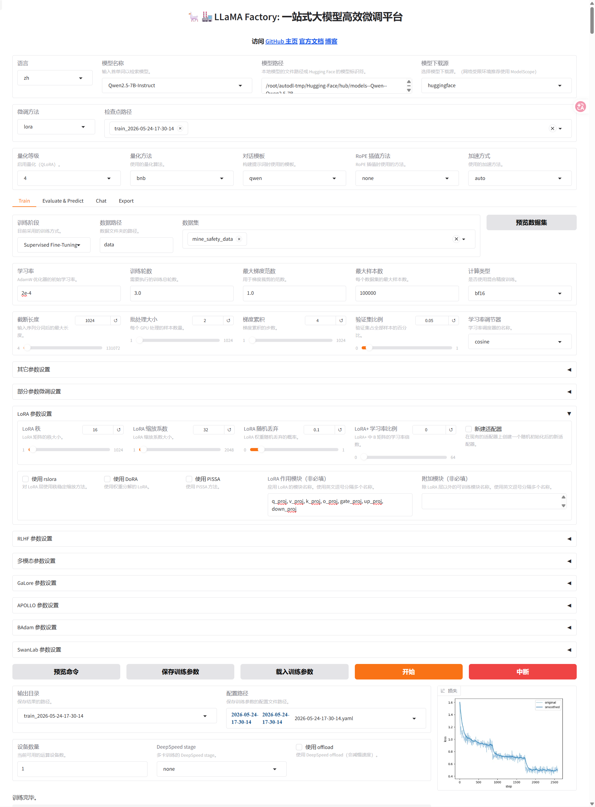

### 配置文件（train.yaml）

```yaml
# === 基本配置 ===
model_name_or_path: /root/autodl-tmp/Hugging-Face/hub/models--Qwen--Qwen2.5-7B-Instruct/snapshots/<snapshot_id>
stage: sft
do_train: true
finetuning_type: lora
template: qwen
trust_remote_code: true

# === 量化配置（QLoRA）===
quantization_bit: 4
quantization_method: bnb
double_quantization: true

# === LoRA 超参 ===
lora_rank: 16
lora_alpha: 32
lora_dropout: 0.1
lora_target: q_proj, v_proj, k_proj, o_proj, gate_proj, up_proj, down_proj

# === 训练超参 ===
bf16: true
learning_rate: 0.0002
lr_scheduler_type: cosine
num_train_epochs: 3.0
max_grad_norm: 1.0
optim: adamw_torch
warmup_steps: 0
per_device_train_batch_size: 2
per_device_eval_batch_size: 2
gradient_accumulation_steps: 4
cutoff_len: 2048
packing: false

# === 数据集 ===
dataset: mine-safety-data
dataset_dir: data
max_samples: 100000
val_size: 0.1
preprocessing_num_workers: 16

# === 日志与保存 ===
logging_steps: 5
save_steps: 100
eval_steps: 100
eval_strategy: steps
plot_loss: true
output_dir: saves/Qwen2.5-7B-Instruct/lora/train_1
report_to: none
flash_attn: auto
enable_thinking: true
include_num_input_tokens_seen: true
ddp_timeout: 180000000
```

### 关键参数说明

| 参数 | 值 | 说明 |
|------|----|------|
| `quantization_bit` | 4 | 4-bit 量化，大幅降低显存占用 |
| `lora_rank` | 16 | 低秩矩阵的秩，平衡参数量与表达能力 |
| `lora_alpha` | 32 | LoRA 缩放系数，一般为 rank 的 2 倍 |
| `learning_rate` | 0.0002 | LoRA 微调常用学习率 |
| `cutoff_len` | 2048 | 与数据集最大分割长度匹配 |
| `num_train_epochs` | 3.0 | 建议 2-3，本项目观察到 3 epoch 有轻微过拟合 |

---

## 6. 结果评估

### 训练结果

| 指标 | 值 |
|------|----|
| 训练时间 | 约 1 小时 25 分钟 |
| 最终 train_loss | 0.7288 |
| 最终 eval_loss | 0.9175 |

### 损失曲线分析

**训练集损失曲线**：

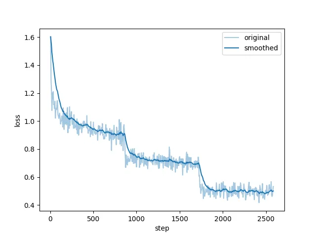

**验证集损失曲线**：

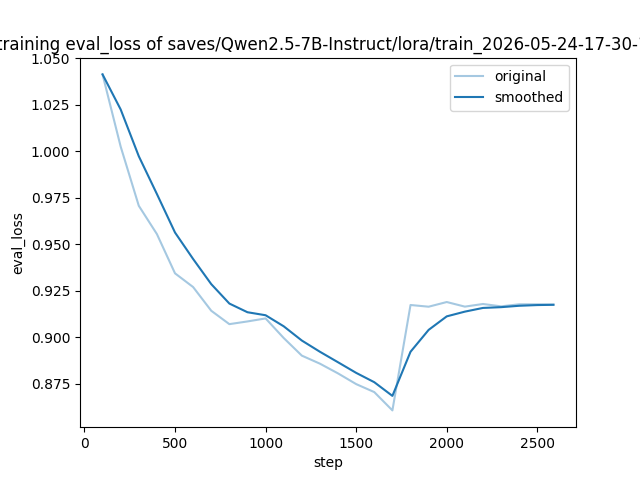

**训练集损失**：从 ~1.6 持续下降至 ~0.5，整体学习趋势良好。在 Epoch 切换点（Step ~850、~1700）出现阶梯状下降，与数据集重新 Shuffle 相关。

**验证集损失**：前两个 Epoch 同步下降至 ~0.86（最优），但进入第三个 Epoch 后**反弹至 ~0.9175**，出现轻微过拟合。

**结论**：模型在第 3 个 Epoch 发生了轻微过拟合，**最理想的停止点在第二个 Epoch 结束（约 Step 1700）**。对这个数据集而言，跑 3 个 Epoch 太多，最终输出的 Epoch 3 模型泛化能力反而不如 Epoch 2 的中间权重。

---

## 7. 模型导出与使用

### 导出步骤

1. 在 webui 中点击「检查点路径」，加载训练好的 LoRA 检查点：

   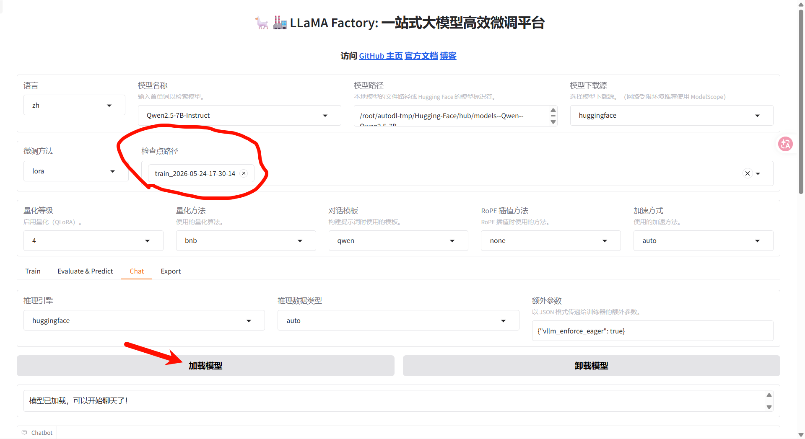

   加载完成后可进行对话测试，对比微调前后效果。

2. 点击 `Export`，填写导出路径，执行导出：

   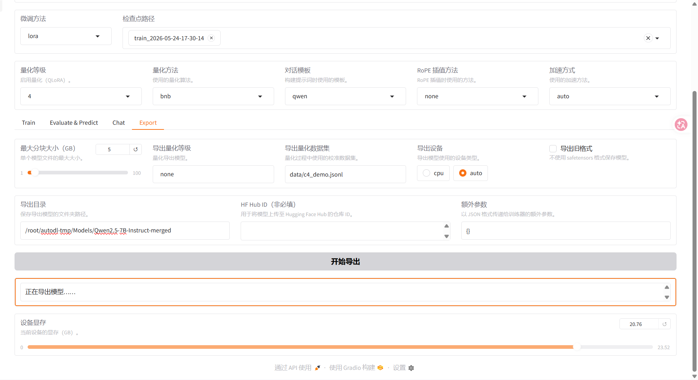

```bash
mkdir -p Models/Qwen2.5-7B-Instruct-merged
```

### 导出文件说明

导出后的目录结构如下：

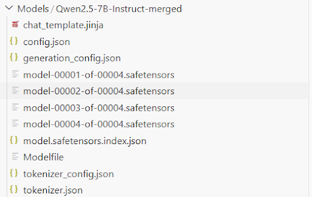

| 文件 | 说明 |
|------|------|
| `config.json` | 模型结构配置（28层 Transformer，隐藏维度 3584，注意力头 28） |
| `model-00001-of-00004.safetensors` 等 | 模型权重文件（共 4 个分片，约 14GB） |
| `model.safetensors.index.json` | 权重分片索引 |
| `tokenizer.json` / `tokenizer_config.json` | 分词器配置 |
| `chat_template.jinja` | Qwen 专用 ChatML 对话模板 |
| `Modelfile` | Ollama 部署配置，可直接用 `ollama create` 本地部署 |
| `generation_config.json` | 文本生成默认参数（top_p、temperature 等） |

### 微调效果对比示例

**测试问题**：在深度 800 米的煤矿中，设计一条双轨矿山运输巷道时，确定断面尺寸（净宽、净高）的核心依据和标准步骤是什么？

经 Gemini 3.5 Flash 以矿山安全专家身份评估，两个回答均偏宽泛，但微调后的回答（回答二）在逻辑框架上略好——步骤从需求分析→初步设计→安全性评估→施工图设计，更贴合工程实际；而微调前的回答偏向项目管理/行政管理视角。不过两者均缺乏深井围岩应力、风速校验等硬核技术参数，差距并不显著。

参考 DeepSeek-v4-Pro 对该问题的专业回答：

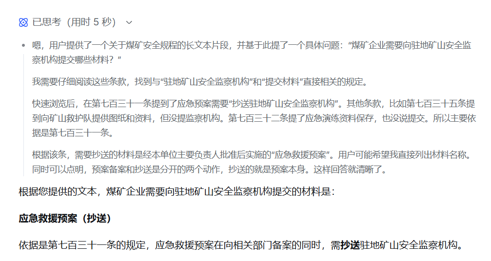

---

## 相关工具与资源

| 工具 | 用途 | 链接 |
|------|------|------|
| MinerU | PDF 转 Markdown | [在线平台](https://mineru.net/OpenSourceTools/Extractor) |
| Easy Dataset | QA 数据集生成 | [使用教程](https://zhuanlan.zhihu.com/p/29942660863) |
| LLaMA Factory | 微调框架 | [GitHub](https://github.com/hiyouga/LlamaFactory) |
| AutoDL | 云 GPU 服务器 | [官网](https://www.autodl.com) |
| FileZilla | 文件传输 | [下载](https://filezilla-project.org/download.php?type=client) |

---

## License

本项目使用的基座模型 Qwen2.5-7B-Instruct 遵循 [Qwen Research License](https://github.com/QwenLM/Qwen2.5/blob/main/LICENSE)。训练数据来源于国家矿山安全相关法规，仅供研究与学习使用。
